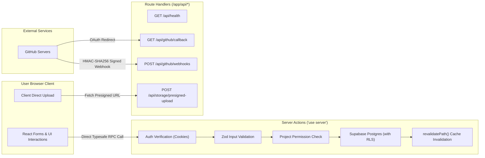

# Build Together — API Specification & Interface Contracts

**Version:** 1.1.0  
**Status:** Approved Architectural Document  
**Target:** Next.js Server Actions + Route Handlers (`app/api/*`)  

---

## 1. Architectural Contract: Server Actions vs. Route Handlers

Build Together adopts a strict architectural separation:



### Architectural Principles:
1. **Application Mutations via Server Actions:**
   All end-user interactions (creating projects, submitting contribution pitches, updating task statuses, code review approvals, community posts, sticky notes) are implemented via typed Next.js Server Actions.
2. **Route Handlers (`/app/api/*`) Strictly for Machine-to-Machine & Webhooks:**
   Reserved exclusively for external OAuth callbacks, incoming GitHub webhooks, presigned upload URLs, and health checks.

---

## 2. Standardized Action Result Pattern

```typescript
export type ActionSuccess<T> = {
  success: true;
  data: T;
  message?: string;
};

export type ActionError = {
  success: false;
  error: {
    code: 'UNAUTHORIZED' | 'FORBIDDEN' | 'NOT_FOUND' | 'VALIDATION_ERROR' | 'CONFLICT' | 'INTERNAL_ERROR';
    message: string;
    details?: Record<string, string[]>;
  };
};

export type ActionResult<T> = ActionSuccess<T> | ActionError;
```

---

## 3. Server Actions Specification

### 3.1 Developer Profile, Experiences & Connections

#### `updateProfileAction(input: UpdateProfileInput): Promise<ActionResult<Profile>>`
- **Access:** Authenticated user (self only).
- **Zod Schema:**
  ```typescript
  export const updateProfileSchema = z.object({
    username: z.string().min(3).max(30).regex(/^[a-zA-Z0-9_-]+$/),
    fullName: z.string().min(1).max(100),
    headline: z.string().max(160).optional(),
    bio: z.string().max(2000).optional(),
    location: z.string().max(100).optional(),
    timezone: z.string().max(50).default('UTC'),
    availabilityHours: z.number().int().min(0).max(100),
    portfolioUrl: z.string().url().or(z.literal('')).optional(),
    skills: z.array(z.string().uuid()).max(20),
    technologies: z.array(z.string().uuid()).max(20),
    socialLinks: z.record(z.string()).optional()
  });
  ```

#### `addProfileExperienceAction(input: AddExperienceInput): Promise<ActionResult<ProfileExperience>>`
- **Access:** Authenticated user.
- **Zod Schema:**
  ```typescript
  export const addExperienceSchema = z.object({
    title: z.string().min(2).max(100),
    companyOrProject: z.string().min(2).max(100),
    startDate: z.string().date(),
    endDate: z.string().date().optional(),
    isCurrent: z.boolean().default(false),
    description: z.string().max(1000).optional()
  });
  ```

#### `sendConnectionRequestAction(recipientId: string): Promise<ActionResult<UserConnection>>`
- **Access:** Authenticated user sending request to a peer.

#### `respondConnectionRequestAction(connectionId: string, decision: 'accepted' | 'declined'): Promise<ActionResult<UserConnection>>`
- **Access:** Authenticated recipient of the connection request.

---

### 3.2 Developer Community Feed Actions

#### `createPostAction(input: CreatePostInput): Promise<ActionResult<CommunityPost>>`
- **Description:** Publishes a technical post to the community feed.
- **Access:** Authenticated user.
- **Zod Schema:**
  ```typescript
  export const createPostSchema = z.object({
    postType: z.enum([
      'project_announcement',
      'recruitment',
      'technical_discussion',
      'project_update',
      'question',
      'achievement',
      'learning'
    ]),
    title: z.string().min(5).max(150),
    content: z.string().min(20).max(10000),
    projectId: z.string().uuid().optional(),
    tags: z.array(z.string().max(30)).max(5).default([])
  });
  ```
- **Side Effects:** Inserts `community_posts`, revalidates `/feed`.

#### `toggleLikePostAction(postId: string): Promise<ActionResult<{ liked: boolean; count: number }>>`
- **Access:** Authenticated user. Toggles user entry in `post_likes`.

#### `addPostCommentAction(input: AddPostCommentInput): Promise<ActionResult<PostComment>>`
- **Access:** Authenticated user. Supports nested replies via `parentId`.

#### `toggleSavePostAction(postId: string): Promise<ActionResult<{ saved: boolean }>>`
- **Access:** Authenticated user bookmarking a post.

---

### 3.3 Project Creation & Deterministic Matching

#### `createProjectAction(input: CreateProjectInput): Promise<ActionResult<Project>>`
- **Access:** Authenticated user.
- **Zod Schema:**
  ```typescript
  export const createProjectSchema = z.object({
    title: z.string().min(3).max(80),
    slug: z.string().min(3).max(50).regex(/^[a-z0-9-]+$/),
    tagline: z.string().min(10).max(160),
    description: z.string().min(50).max(5000),
    problemStatement: z.string().min(20).max(3000),
    proposedSolution: z.string().min(20).max(3000),
    category: z.string().min(2).max(50),
    stage: z.enum(['idea', 'planning', 'in_development', 'testing', 'shipped']),
    visibility: z.enum(['public', 'private']),
    roles: z.array(z.object({
      title: z.string().min(2).max(60),
      description: z.string().min(10).max(500),
      requiredSkills: z.array(z.string()),
      capacityCount: z.number().int().min(1).max(10),
      commitmentHours: z.number().int().min(1).max(60)
    })).min(1).max(10)
  });
  ```

#### `getPersonalizedProjectsAction(): Promise<ActionResult<Array<Project & { matchScore: number }>>>`
- **Description:** Runs deterministic matching using `calculate_project_match_score` for the current user's profile.

---

### 3.4 Contribution Requests & Team Formation

#### `submitContributionRequestAction(input: SubmitContributionInput): Promise<ActionResult<ContributionRequest>>`
- **Access:** Authenticated user not currently a member.
- **Zod Schema:**
  ```typescript
  export const submitContributionSchema = z.object({
    projectId: z.string().uuid(),
    projectRoleId: z.string().uuid().optional(),
    pitch: z.string().min(30).max(2000),
    portfolioLinks: z.array(z.string().url()).max(5),
    weeklyHours: z.number().int().min(1).max(80)
  });
  ```

#### `reviewContributionRequestAction(input: ReviewContributionInput): Promise<ActionResult<ContributionRequest>>`
- **Access:** Project owner or maintainers.

#### `withdrawContributionRequestAction(requestId: string): Promise<ActionResult<void>>`
- **Access:** Application author.

---

### 3.5 Tasks & Kanban Execution

#### `createTaskAction(input: CreateTaskInput): Promise<ActionResult<Task>>`
- **Access:** Project members.

#### `updateTaskStatusAction(input: UpdateTaskStatusInput): Promise<ActionResult<Task>>`
- **Access:** Project members. Updates status lane and drag position.

#### `addTaskCommentAction(input: AddTaskCommentInput): Promise<ActionResult<TaskComment>>`
- **Access:** Project members.

---

### 3.6 Project Canvas & Sticky Notes Actions

#### `saveCanvasItemAction(input: SaveCanvasItemInput): Promise<ActionResult<ProjectCanvasItem>>`
- **Description:** Creates or edits a freeform sticky note or idea card on the project canvas.
- **Access:** Project members.
- **Zod Schema:**
  ```typescript
  export const saveCanvasItemSchema = z.object({
    id: z.string().uuid().optional(),
    projectId: z.string().uuid(),
    itemType: z.enum(['sticky_note', 'idea', 'risk', 'tech_stack', 'decision']),
    content: z.string().min(1).max(1000),
    color: z.string().regex(/^#[0-9a-fA-F]{6}$/).default('#fef08a'),
    positionX: z.number().default(100),
    positionY: z.number().default(100)
  });
  ```

#### `updateCanvasItemPositionAction(itemId: string, x: number, y: number): Promise<ActionResult<void>>`
- **Access:** Project members.

#### `deleteCanvasItemAction(itemId: string): Promise<ActionResult<void>>`
- **Access:** Author or project admin.

---

### 3.7 Code Workspace & Code Reviews

#### `saveCodeSnippetAction(input: SaveCodeSnippetInput): Promise<ActionResult<CodeSnippet>>`
- **Access:** Project members.

#### `createCodeReviewAction(input: CreateCodeReviewInput): Promise<ActionResult<CodeReview>>`
- **Access:** Project members.

#### `submitReviewDecisionAction(input: ReviewDecisionInput): Promise<ActionResult<CodeReview>>`
- **Access:** Project admins / designated reviewers (`approved` or `changes_requested`).

#### `addCodeReviewCommentAction(input: AddReviewCommentInput): Promise<ActionResult<CodeReviewComment>>`
- **Access:** Project members. Posts inline line-by-line comment on file diff.

#### `createGitHubPullRequestFromReviewAction(input: CreatePrFromReviewInput): Promise<ActionResult<{ prUrl: string; prNumber: number }>>`
- **Access:** Project owner or maintainers with approved review.
- **Description:** Verifies review approval, decrypts repo OAuth token, creates feature branch, commits file diffs via Git Trees API, opens Pull Request, and links PR to code review.
- **Zod Schema:**
  ```typescript
  export const createPrFromReviewSchema = z.object({
    reviewId: z.string().uuid(),
    projectId: z.string().uuid(),
    branchName: z.string().min(2).max(100).regex(/^[a-zA-Z0-9._\-/]+$/),
    prTitle: z.string().min(3).max(150),
    prBody: z.string().min(5).max(5000),
  });
  ```

---

### 3.8 GitHub Integration Server Actions

#### `initiateGitHubOAuthAction(options?: { projectId?: string; returnPath?: string }): Promise<ActionResult<{ authUrl: string }>>`
- **Access:** Authenticated user.
- **Description:** Generates a cryptographically random CSRF nonce, binds user ID and return path in state payload, sets secure httpOnly cookie `bt_github_oauth_state`, and returns the GitHub OAuth URL.

#### `disconnectUserGitHubAccountAction(): Promise<ActionResult<void>>`
- **Access:** Authenticated user.
- **Description:** Disconnects the user's personal GitHub account and deletes encrypted tokens from `user_github_accounts`.

#### `getAvailableRepositoriesAction(projectId: string): Promise<ActionResult<GitHubRepoOption[]>>`
- **Access:** Project admin (owner or maintainer).
- **Description:** Decrypts admin's GitHub token and queries GitHub API for repositories where the user has push or admin privileges.

#### `connectProjectRepositoryAction(input: ConnectRepoInput): Promise<ActionResult<ProjectGithubRepo>>`
- **Access:** Project admin.
- **Description:** Validates repository access and permissions on GitHub, registers repository webhook (`X-Hub-Signature-256`), caches default branches, encrypts repo token via AES-256-GCM, and upserts into `project_github_repos`.
- **Zod Schema:**
  ```typescript
  export const connectRepoSchema = z.object({
    projectId: z.string().uuid(),
    repoId: z.number().int().positive(),
    repoOwner: z.string().min(1).max(100).regex(/^[a-zA-Z0-9._-]+$/),
    repoName: z.string().min(1).max(100).regex(/^[a-zA-Z0-9._-]+$/),
    defaultBranch: z.string().min(1).max(100).default('main'),
  });
  ```

#### `disconnectProjectRepositoryAction(input: DisconnectRepoInput): Promise<ActionResult<void>>`
- **Access:** Project admin.
- **Description:** Unregisters GitHub repository webhook and deletes repository link from `project_github_repos`.

#### `syncProjectRepositoryAction(input: SyncRepoInput): Promise<ActionResult<{ syncedAt: string }>>`
- **Access:** Project members.
- **Description:** Fetches fresh repository stars, forks, open issues count, and branch list from GitHub API and updates cache.

---

### 3.9 Community Feed, Developer Network & Notifications Server Actions

#### `createPostAction(input: CreatePostInput): Promise<ActionResult<CommunityPost>>`
- **Access:** Authenticated user.
- **Description:** Creates a technical community post, verifies project membership if `project_id` is supplied, and dispatches `@mention` notifications to referenced developers.
- **Zod Schema:**
  ```typescript
  export const createPostSchema = z.object({
    title: z.string().trim().min(3).max(200),
    content: z.string().trim().min(5).max(10000),
    post_type: z.enum([
      'project_announcement', 'recruitment', 'technical_discussion',
      'project_update', 'question', 'achievement', 'learning'
    ]),
    project_id: z.string().uuid().optional().nullable(),
    tags: z.array(z.string().regex(/^[a-zA-Z0-9_-]+$/)).max(10).default([])
  });
  ```

#### `updatePostAction(input: UpdatePostInput): Promise<ActionResult<CommunityPost>>`
- **Access:** Post author.
- **Description:** Updates an authored post and verifies project authorization if `project_id` is modified.

#### `deletePostAction(input: DeletePostInput): Promise<ActionResult<{ deleted: boolean }>>`
- **Access:** Post author.

#### `togglePostLikeAction(input: TogglePostLikeInput): Promise<ActionResult<{ hasLiked: boolean }>>`
- **Access:** Authenticated user.
- **Description:** Toggles like on a community post. Triggers a `post_like` notification to the post author.

#### `togglePostSaveAction(input: TogglePostSaveInput): Promise<ActionResult<{ hasSaved: boolean }>>`
- **Access:** Authenticated user.
- **Description:** Toggles bookmark/save on a community post for the current user.

#### `createPostCommentAction(input: CreatePostCommentInput): Promise<ActionResult<PostComment>>`
- **Access:** Authenticated user.
- **Description:** Posts a top-level comment or nested reply on a post. Dispatches notifications to the post author, parent comment author (if a reply), and mentioned users.

#### `deletePostCommentAction(input: DeletePostCommentInput): Promise<ActionResult<{ deleted: boolean }>>`
- **Access:** Comment author.

#### `sendConnectionRequestAction(input: SendConnectionRequestInput): Promise<ActionResult<UserConnection>>`
- **Access:** Authenticated user.
- **Description:** Sends a peer connection request to another developer. Rejects self-connection and duplicates, and creates a `connection_request` notification.

#### `respondConnectionRequestAction(input: RespondConnectionRequestInput): Promise<ActionResult<{ status: string }>>`
- **Access:** Recipient of the connection request.
- **Description:** Accepts or declines an incoming connection request. On accept, dispatches a `connection_accepted` notification to the requester.

#### `removeConnectionAction(input: RemoveConnectionInput): Promise<ActionResult<{ removed: boolean }>>`
- **Access:** Either participant in the connection.

#### `markNotificationReadAction(input: MarkNotificationReadInput): Promise<ActionResult<{ success: boolean }>>`
- **Access:** Notification recipient.

#### `markAllNotificationsReadAction(): Promise<ActionResult<{ success: boolean }>>`
- **Access:** Authenticated user.

### 3.10 Global Search Actions

#### `globalSearchAction(input: SearchQueryInput): Promise<ActionResult<GlobalSearchResponse>>`
- **Access:** Public / Authenticated (Strict Privacy Filtering).
- **Description:** Performs a PostgreSQL-native multi-entity search across projects, developer profiles, community posts, and workspace tasks.
- **Input Schema:**
  ```typescript
  export const searchQuerySchema = z.object({
    q: z.string().trim().min(1).max(100),
    type: z.enum(['all', 'projects', 'developers', 'posts', 'tasks']).optional().default('all'),
    limit: z.number().int().min(1).max(50).optional().default(20),
  });
  ```
- **Authorization & Privacy Rules:**
  - Public projects, verified developer profiles, and public posts are searchable by anyone.
  - Posts belonging to private projects are only returned if the requesting user is a project member.
  - Workspace tasks are strictly restricted to authenticated members of the respective projects.

---

## 4. Route Handlers (`app/api/*`)

### 4.1 `GET /api/health`
System status and Supabase connectivity check.

### 4.2 `GET /api/github/callback`
GitHub OAuth redirect handler:
1. Validates CSRF state against secure cookie nonce.
2. Verifies state expiry (< 10 minutes) and user identity.
3. Server-side code exchange with GitHub OAuth servers (`https://github.com/login/oauth/access_token`).
4. Fetches authenticated GitHub profile (`/user`).
5. Encrypts user access token using AES-256-GCM with master `ENCRYPTION_KEY`.
6. Upserts profile into `user_github_accounts`.
7. Safely redirects to workspace or destination route.

### 4.3 `POST /api/github/webhooks`
External GitHub webhook receiver:
1. Verifies `X-Hub-Signature-256` HMAC-SHA256 signature using `timingSafeEqual`.
2. Rejects invalid or missing signatures with 401.
3. Idempotently deduplicates events using `X-GitHub-Delivery` header and `github_webhook_events`.
4. Processes `push`, `pull_request` (updates code review and PR status), and `pull_request_review` events.
5. Records delivery status and audit trail.

### 4.4 `POST /api/storage/presigned-upload`
Generates presigned upload URLs for Supabase Storage (`avatars`, `project-assets`, `workspace-files`).
