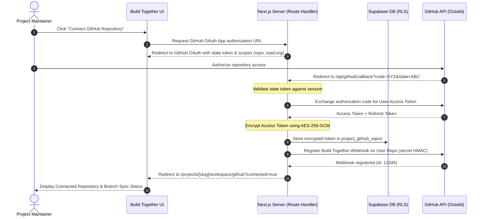
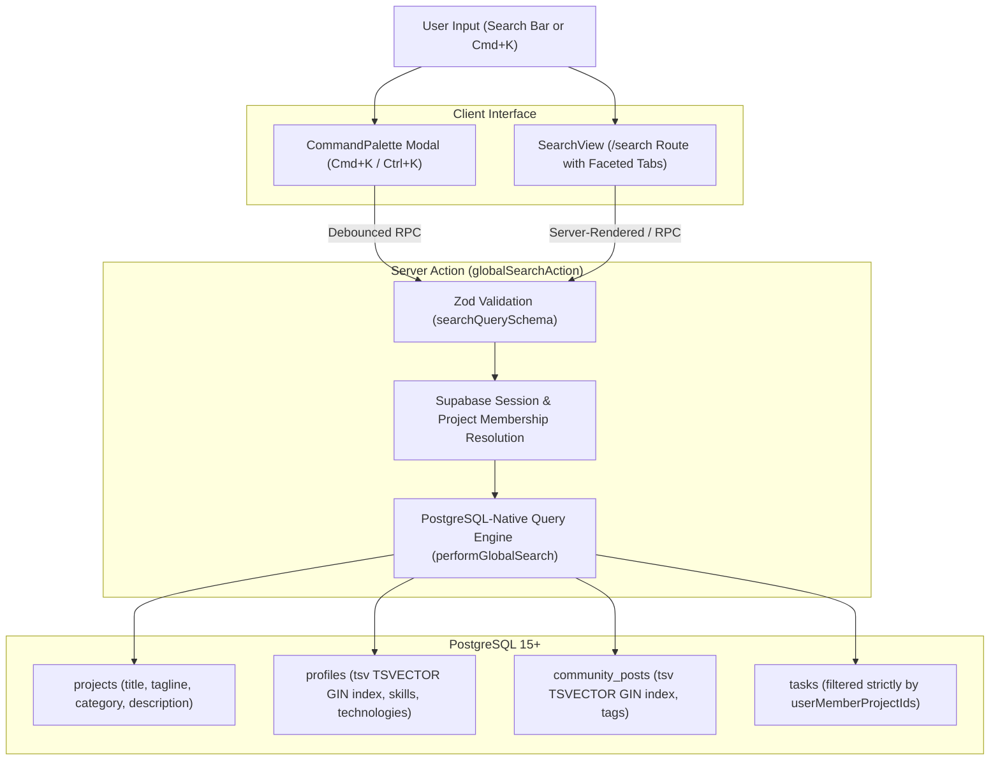

# Build Together — System Architecture

**Version:** 1.0.0  
**Status:** Approved Architectural Document  
**Target Platform:** Next.js (App Router) + TypeScript + Tailwind CSS + Supabase + Vercel + GitHub  

---

## 1. High-Level Architecture Overview

Build Together is architected as a modern, serverless, edge-ready web application. It deliberately avoids a separate Express/Nest/Fastify backend server, fully leveraging **Next.js App Router Server Components & Server Actions** for application business logic, paired with **Supabase PostgreSQL** for data persistence, authentication, storage, and realtime primitives.

### System Architecture Diagram

```mermaid
flowchart TB
    subgraph Client ["Client Tier (Browser)"]
        UI["React 19 Client Leaves (UI/Interactivity)"]
        RT_Client["Supabase Realtime Client (WebSockets)"]
    end

    subgraph Vercel ["Vercel Edge & Serverless Platform"]
        MW["Next.js Edge Middleware\n(Session Refresh, Route Guarding)"]
        RSC["Next.js React Server Components\n(SSR / Streaming / Data Fetching)"]
        SA["Next.js Server Actions\n(Mutations, Zod Validation, Auth Checks)"]
        RH["Next.js Route Handlers / API\n(OAuth Callbacks, Webhook Receivers)"]
    end

    subgraph Supabase ["Supabase Cloud Platform"]
        S_Auth["Supabase Auth (GoTrue)\nJWTs & Cookies"]
        S_DB[("PostgreSQL 15+\nRow Level Security (RLS)\nTriggers, Enums, Constraints")]
        S_RT["Supabase Realtime\n(PostgreSQL CDC & Broadcast)"]
        S_Store["Supabase Storage\n(S3-Compatible Buckets)"]
    end

    subgraph External ["External Services"]
        GH_BT["GitHub: Build Together Repo\n(Source Control & CI/CD)"]
        GH_User["GitHub: User Repositories\n(OAuth, Octokit API, Webhooks)"]
    end

    %% Client Interactions
    UI -->|HTTPS / Next.js Navigation| MW
    MW -->|Authorized Request| RSC
    UI -->|Mutations / Form Submissions| SA
    UI -->|OAuth / Webhooks / Uploads| RH
    RT_Client <-->|WSS (Realtime Broadcast)| S_RT

    %% Next.js to Supabase
    RSC -->|Query with Cookie Session (RLS)| S_DB
    SA -->|Execute Transaction (RLS)| S_DB
    RH -->|Admin Operations / Webhooks (Service Role)| S_DB
    SA -->|File Upload Coordination| S_Store
    MW <-->|Session Refresh| S_Auth

    %% Next.js to External
    GH_BT -->|Git Push Trigger| Vercel
    RH <-->|Octokit REST/GraphQL API| GH_User
    GH_User -->|Signed Webhooks (HMAC-SHA256)| RH

    %% Supabase Internal
    S_DB -->|WAL Change Events| S_RT
```

---

## 2. Technology Stack & Decision Matrix

| Layer | Selected Technology | Architectural Rationale & Tradeoffs |
| :--- | :--- | :--- |
| **Framework** | **Next.js 15+ (App Router)** | Zero-bundle data fetching via React Server Components (RSC); co-located mutations via Server Actions; native edge middleware for auth token refreshes; seamless deployment on Vercel. |
| **Language** | **TypeScript 5 (Strict Mode)** | End-to-end type safety spanning database schema definitions, server action inputs/outputs, and client UI components. |
| **Styling** | **Tailwind CSS v3/v4** | Zero runtime CSS overhead, standardized design tokens, rapid responsive layout development, dark/light theme support. |
| **Database** | **Supabase PostgreSQL 15+** | Relational integrity (foreign keys, cascading rules), native JSONB for flexible metadata, full-text search with `tsvector`, and fine-grained declarative security via Row Level Security (RLS). |
| **Authentication** | **Supabase Auth (`@supabase/ssr`)** | Industry-standard JWT auth with HTTP-only, secure, partitioned cookies. Native OAuth integration for GitHub. |
| **Storage** | **Supabase Storage** | S3-compatible asset storage for avatars, project screenshots, and project files with storage access policies tied to PostgreSQL identities. |
| **Realtime** | **Supabase Realtime** | WebSocket-based change data capture (CDC) and broadcast channels used selectively for live Kanban updates and user notifications. |
| **Hosting & CI/CD** | **Vercel** | Automated branch deployments, edge caching, serverless scale-to-zero compute, environment variable governance, global CDN. |
| **Code Integration**| **Octokit REST & GraphQL APIs** | Direct, secure server-to-server communication with user GitHub repositories without intermediary proxies. |

---

## 3. Next.js Architecture & Boundaries

### 3.1 Server Components vs. Client Components Boundary Strategy
To guarantee peak performance and avoid bundle bloat, Build Together enforces a strict component classification:

- **React Server Components (RSC) by Default:**
  - All page layouts (`layout.tsx`) and route pages (`page.tsx`) are Server Components.
  - Direct database fetching occurs in RSC via authenticated Supabase server clients.
  - Static HTML is generated on the server and streamed via React Suspense boundaries.
  - Client component bundles are never downloaded for static content (marketing pages, project showcase reads, user profiles).

- **Client Components (`'use client'`) Strictly at Interactive Leaves:**
  - Interactive forms requiring client-side feedback (e.g. project creation wizard, contribution request pitch).
  - Drag-and-drop surfaces (Kanban task board).
  - Modal dialog triggers, dropdown menus, and command palettes.
  - Syntax highlighter / code diff viewers with line toggles.
  - Realtime subscription hooks (`useRealtimeTaskBoard`, `useNotifications`).

### 3.2 Data Access Layer (DAL) & Supabase Client Factory
Client instantiation is strictly segregated into three discrete utility patterns to eliminate security leaks:

```
src/lib/supabase/
├── client.ts       # Browser client (for Client Components, anon key only)
├── server.ts       # Server client (for RSC & Server Actions, reads cookies)
├── middleware.ts   # Edge middleware client (for session validation & cookie refresh)
└── admin.ts        # Privileged admin client (Service Role key - SERVER ONLY, strictly for webhooks)
```

1. **Browser Client (`client.ts`):**
   - Uses `createBrowserClient(NEXT_PUBLIC_SUPABASE_URL, NEXT_PUBLIC_SUPABASE_ANON_KEY)`.
   - Used only in Client Components for realtime channel listeners and client-initiated uploads.

2. **Server Client (`server.ts`):**
   - Uses `createServerClient` from `@supabase/ssr` with Next.js `cookies()` store.
   - Automatically passes the user's session JWT to PostgreSQL.
   - All queries executed through this client automatically inherit the active user's Row Level Security context.

3. **Admin Client (`admin.ts`):**
   - Uses `createClient(SUPABASE_URL, SUPABASE_SERVICE_ROLE_KEY, { auth: { persistSession: false } })`.
   - **Strict Rule:** Never imported in any client file, page, or standard server action.
   - Restricted exclusively to trusted server route handlers: verifying incoming GitHub webhooks and executing system-level maintenance tasks.

---

## 4. Mutation & State Management Architecture

### 4.1 Server Actions Pattern
All application mutations (creating a project, applying for a role, updating a task status, submitting a code review) are handled through typed Next.js Server Actions:

```typescript
// Architectural Flow of a Server Action
export async function updateTaskStatusAction(input: UpdateTaskStatusInput): Promise<ActionResult<Task>> {
  // 1. Authenticate user session from secure cookies
  const supabase = await createServerClient();
  const { data: { user }, error: authError } = await supabase.auth.getUser();
  if (authError || !user) throw new UnauthorizedError();

  // 2. Validate input schema with Zod
  const validated = updateTaskStatusSchema.parse(input);

  // 3. Verify user has permission in the project (Maintainer or Assignee)
  const isMember = await verifyProjectMembership(supabase, validated.projectId, user.id);
  if (!isMember) throw new ForbiddenError("Insufficient project permissions");

  // 4. Execute atomic database update (governed by RLS)
  const { data: updatedTask, error: dbError } = await supabase
    .from('tasks')
    .update({ status: validated.newStatus, updated_at: new Date().toISOString() })
    .eq('id', validated.taskId)
    .select()
    .single();

  if (dbError) throw new DatabaseError(dbError.message);

  // 5. Append immutable activity log entry
  await recordActivityLog(supabase, {
    projectId: validated.projectId,
    actorId: user.id,
    action: 'TASK_STATUS_UPDATED',
    metadata: { taskId: validated.taskId, oldStatus: validated.oldStatus, newStatus: validated.newStatus }
  });

  // 6. Targeted Next.js cache revalidation
  revalidatePath(`/projects/${validated.projectSlug}/workspace/tasks`);

  return { success: true, data: updatedTask };
}
```

### 4.2 Optimistic Updates & Local State
- For high-frequency interactions (such as dragging a task card across Kanban columns or toggling an issue checkbox), client components utilize React 19's `useOptimistic` hook.
- The UI reflects the state change immediately; if the Server Action rejects the change (e.g. permission denied), the UI seamlessly rolls back with a toast alert.

### 4.3 URL as Single Source of Truth
- All filters (search keywords, role categories, tech stack tags, milestone selectors, active workspace tabs) are encoded directly in URL query parameters (`searchParams`).
- Benefits: Shareable link states, browser back/forward history support, and zero desynchronization between client state and server-rendered markup.

---

## 5. User Project GitHub Integration Architecture

Build Together strictly separates its own repository deployment from user-connected project repositories.



### 5.1 Token Encryption & Storage
- Third-party GitHub OAuth access tokens are **never** stored as plaintext.
- Tokens are encrypted at rest using authenticated **AES-256-GCM** with a rotating master encryption key stored in Vercel environment variables (`ENCRYPTION_KEY`).
- Decryption occurs strictly in serverless memory when an authorized action (such as exporting a code review as a Pull Request) is executed by a verified project maintainer.

### 5.2 Code Review to GitHub PR Export Pipeline
When an internal Build Together code review receives required approvals:
1. Maintainer clicks **"Export to GitHub PR"**.
2. Server action fetches the approved file diffs from `code_reviews` and `code_review_files`.
3. The server decrypts the user repository token.
4. Using Octokit, the server:
   - Verifies the base branch (`main` or `develop`).
   - Creates a new feature branch (`buildtogether/review-<id>`).
   - Commits the changed files with commit metadata attributing the original authors.
   - Opens a GitHub Pull Request with a backlink to the Build Together review thread and audit log.
5. Updates `code_reviews.github_pr_url` and marks status as `merged_to_github`.

---

## 6. Realtime Strategy & WebSocket Lifecycle

To avoid connection exhaustion on Supabase while ensuring a responsive multi-user workspace:

1. **Selective Scoping:**
   - Realtime connections are **disabled** on all public browsing pages (marketing, explore directory, public profiles).
   - Realtime connections are initiated **only** when a user enters an active `/projects/[slug]/workspace/*` route.

2. **Channel Strategy:**
   - `project:[id]:tasks`: Broadcasts task creation, movement, and assignee changes to teammates.
   - `project:[id]:reviews`: Broadcasts inline comments and approval state changes.
   - `user:[id]:notifications`: Unicast channel delivering real-time toast alerts for mentions and application updates.

3. **Lifecycle Management:**
   - Handled via a customized `useEffect` hook with strict cleanup (`supabase.removeChannel(channel)` on component unmount) to prevent connection leaks during client-side navigation.

---

## 7. Storage Architecture

Supabase Storage is organized into 3 purpose-specific buckets:

| Bucket Name | Access Model | Max File Size | Allowed MIME Types | Intended Content |
| :--- | :--- | :--- | :--- | :--- |
| `avatars` | Public Read / Authenticated Write | 2 MB | `image/png`, `image/jpeg`, `image/webp` | User profile avatars and project logos. |
| `project-assets` | Public Read / Maintainer Write | 5 MB | `image/png`, `image/jpeg`, `image/webp`, `image/svg+xml` | Project banners, showcase screenshots, diagrams. |
| `workspace-files` | Member Read / Member Write | 25 MB | `application/pdf`, `image/*`, `text/*`, `application/zip` | Architectural documents, specs, design assets, and task attachments. |

---

## 8. Directory & Project Structure Plan

```
build-together/
├── .agents/                        # Specialized agent skills & configs
├── docs/                           # Architectural, database, API, and security documentation
├── public/                         # Static assets (favicons, illustrations, icons)
├── src/
│   ├── app/                        # Next.js App Router root
│   │   ├── (marketing)/            # Public marketing layout & pages
│   │   │   ├── page.tsx            # Landing page / value proposition
│   │   │   └── layout.tsx
│   │   ├── (auth)/                 # Authentication flows
│   │   │   ├── login/
│   │   │   ├── register/
│   │   │   └── callback/
│   │   ├── (explore)/              # Public discovery directory
│   │   │   ├── explore/
│   │   │   │   ├── page.tsx        # Project directory
│   │   │   │   ├── roles/page.tsx  # Open roles directory
│   │   │   │   └── developers/page.tsx # Developer directory
│   │   ├── (app)/                  # Authenticated user surfaces
│   │   │   ├── dashboard/          # User personal command center
│   │   │   ├── settings/           # Profile & account configuration
│   │   │   └── projects/
│   │   │       ├── new/            # Project creation wizard
│   │   │       └── [slug]/
│   │   │           ├── page.tsx    # Public project showcase
│   │   │           └── workspace/  # Protected Project Workspace
│   │   │               ├── layout.tsx # Workspace sidebar & context
│   │   │               ├── page.tsx   # Workspace overview
│   │   │               ├── goals/
│   │   │               ├── roadmap/
│   │   │               ├── tasks/
│   │   │               ├── discussions/
│   │   │               ├── meetings/
│   │   │               ├── notes/
│   │   │               ├── files/
│   │   │               ├── code/
│   │   │               ├── reviews/
│   │   │               ├── activity/
│   │   │               ├── team/
│   │   │               ├── github/
│   │   │               └── settings/
│   │   └── api/                    # Route Handlers
│   │       ├── github/
│   │       │   ├── callback/route.ts
│   │       │   └── webhooks/route.ts
│   │       └── health/route.ts
│   ├── components/                 # Reusable React components
│   │   ├── ui/                     # Primitives (Button, Modal, Input, Badge, etc.)
│   │   ├── domain/                 # Domain-specific components
│   │   │   ├── project/
│   │   │   ├── task/
│   │   │   ├── review/
│   │   │   └── profile/
│   │   └── layout/                 # Navigation, Sidebar, Footer, CommandPalette
│   ├── lib/                        # Core utilities & libraries
│   │   ├── supabase/               # Client, server, admin, and middleware clients
│   │   ├── github/                 # Octokit client & webhook verifiers
│   │   ├── crypto/                 # AES-GCM token encryption utilities
│   │   ├── validators/             # Zod input validation schemas
│   │   └── utils/                  # Date formatters, string slugifiers, CN class merger
│   ├── hooks/                      # Custom React hooks (realtime, keyboard shortcuts)
│   ├── types/                      # TypeScript definitions & Supabase DB types
│   └── styles/                     # Tailwind globals and theme definitions
├── supabase/                       # Supabase local environment & migrations
│   ├── migrations/                 # Versioned SQL migration files
│   ├── seed.sql                    # Seed data for local development
│   └── config.toml                 # Local Supabase configuration
├── .env.example                    # Non-secret environment variable template
├── next.config.ts                  # Next.js configuration
├── tailwind.config.ts              # Tailwind CSS configuration
├── tsconfig.json                   # Strict TypeScript compiler configuration
└── package.json                    # Dependency manifest
```

---

## 11. Global Search Architecture & Command Palette

Build Together incorporates an integrated multi-entity search and discovery architecture:



### Key Architectural Invariants:
1. **Server-Side Authorization Boundary:** Unauthenticated requests and users without membership in private projects cannot view private project details or workspace tasks.
2. **PostgreSQL-Native Execution:** Eliminates client-side database dumping and N+1 query patterns by combining GIN-indexed full-text vector lookups (`tsv`) and parameterized pattern filters.
3. **Dual Access Modalities:**
   - Dedicated Discovery Page (`/search?q=...&type=...`) with full faceted navigation (`All`, `Projects`, `Developers`, `Posts`, `Workspace Tasks`).
   - Global Command Palette (`Cmd+K` / `Ctrl+K`) for rapid keyboard-driven navigation across any view in the platform.

