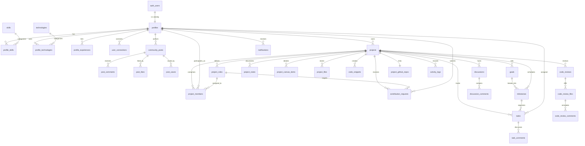

# Build Together — Database Schema & Architecture

**Version:** 1.1.0  
**Database Engine:** PostgreSQL 15+ (Supabase)  
**Schema Governance:** Strict Versioned SQL Migrations (`supabase/migrations/`)  
**Security Model:** 100% Tables Protected with Row Level Security (RLS)  

---

## 1. Entity-Relationship Diagram (ERD)



---

## 2. Core Enumerations & Types

```sql
-- Project development stages
CREATE TYPE project_stage AS ENUM (
  'idea',
  'planning',
  'in_development',
  'testing',
  'shipped'
);

-- Project visibility
CREATE TYPE project_visibility AS ENUM (
  'public',
  'private'
);

-- Member roles within a project
CREATE TYPE project_member_role AS ENUM (
  'owner',
  'maintainer',
  'contributor',
  'viewer'
);

-- Role vacancy status
CREATE TYPE project_role_status AS ENUM (
  'open',
  'filled',
  'closed'
);

-- Contribution application state machine
CREATE TYPE contribution_request_status AS ENUM (
  'pending',
  'under_review',
  'info_requested',
  'accepted',
  'rejected',
  'withdrawn'
);

-- Task Kanban workflow status
CREATE TYPE task_status AS ENUM (
  'backlog',
  'todo',
  'in_progress',
  'review',
  'done'
);

-- Task urgency priority
CREATE TYPE task_priority AS ENUM (
  'low',
  'medium',
  'high',
  'urgent'
);

-- Code review lifecycle
CREATE TYPE code_review_status AS ENUM (
  'draft',
  'review',
  'changes_requested',
  'approved',
  'merged'
);

-- Diff file action type
CREATE TYPE code_review_change_type AS ENUM (
  'added',
  'modified',
  'deleted'
);

-- Community post types
CREATE TYPE community_post_type AS ENUM (
  'project_announcement',
  'recruitment',
  'technical_discussion',
  'project_update',
  'question',
  'achievement',
  'learning'
);

-- Connection status between developers
CREATE TYPE connection_status AS ENUM (
  'pending',
  'accepted',
  'declined',
  'blocked'
);

-- Project Canvas sticky note type
CREATE TYPE canvas_item_type AS ENUM (
  'sticky_note',
  'idea',
  'risk',
  'tech_stack',
  'decision'
);
```

---

## 3. Database Table Definitions

### 3.1 Profiles, Experiences & Taxonomy

```sql
CREATE TABLE public.profiles (
  id UUID PRIMARY KEY REFERENCES auth.users(id) ON DELETE CASCADE,
  username TEXT UNIQUE NOT NULL,
  full_name TEXT NOT NULL,
  avatar_url TEXT,
  banner_url TEXT,
  headline TEXT,
  bio TEXT,
  location TEXT,
  timezone TEXT DEFAULT 'UTC',
  availability_hours_per_week INTEGER DEFAULT 10 CHECK (availability_hours_per_week >= 0),
  github_username TEXT,
  portfolio_url TEXT,
  social_links JSONB DEFAULT '{}'::jsonb,
  created_at TIMESTAMPTZ NOT NULL DEFAULT timezone('utc'::text, now()),
  updated_at TIMESTAMPTZ NOT NULL DEFAULT timezone('utc'::text, now()),

  CONSTRAINT username_length_check CHECK (char_length(username) >= 3 AND char_length(username) <= 30),
  CONSTRAINT username_format_check CHECK (username ~* '^[a-zA-Z0-9_-]+$')
);

CREATE INDEX idx_profiles_username ON public.profiles(username);

CREATE TABLE public.profile_experiences (
  id UUID PRIMARY KEY DEFAULT gen_random_uuid(),
  profile_id UUID NOT NULL REFERENCES public.profiles(id) ON DELETE CASCADE,
  title TEXT NOT NULL,
  company_or_project TEXT NOT NULL,
  start_date DATE NOT NULL,
  end_date DATE,
  is_current BOOLEAN NOT NULL DEFAULT false,
  description TEXT,
  created_at TIMESTAMPTZ NOT NULL DEFAULT timezone('utc'::text, now()),
  updated_at TIMESTAMPTZ NOT NULL DEFAULT timezone('utc'::text, now())
);

CREATE INDEX idx_profile_experiences_profile ON public.profile_experiences(profile_id);

CREATE TABLE public.skills (
  id UUID PRIMARY KEY DEFAULT gen_random_uuid(),
  name TEXT UNIQUE NOT NULL,
  category TEXT NOT NULL, -- Frontend, Backend, UI/UX Design, Security, DevOps, Mobile, AI/ML, QA
  created_at TIMESTAMPTZ NOT NULL DEFAULT timezone('utc'::text, now())
);

CREATE TABLE public.technologies (
  id UUID PRIMARY KEY DEFAULT gen_random_uuid(),
  name TEXT UNIQUE NOT NULL,
  icon TEXT,
  created_at TIMESTAMPTZ NOT NULL DEFAULT timezone('utc'::text, now())
);

CREATE TABLE public.profile_skills (
  profile_id UUID NOT NULL REFERENCES public.profiles(id) ON DELETE CASCADE,
  skill_id UUID NOT NULL REFERENCES public.skills(id) ON DELETE CASCADE,
  PRIMARY KEY (profile_id, skill_id)
);

CREATE TABLE public.profile_technologies (
  profile_id UUID NOT NULL REFERENCES public.profiles(id) ON DELETE CASCADE,
  technology_id UUID NOT NULL REFERENCES public.technologies(id) ON DELETE CASCADE,
  PRIMARY KEY (profile_id, technology_id)
);
```

### 3.2 Developer Connections Network

```sql
CREATE TABLE public.user_connections (
  id UUID PRIMARY KEY DEFAULT gen_random_uuid(),
  requester_id UUID NOT NULL REFERENCES public.profiles(id) ON DELETE CASCADE,
  recipient_id UUID NOT NULL REFERENCES public.profiles(id) ON DELETE CASCADE,
  status connection_status NOT NULL DEFAULT 'pending',
  created_at TIMESTAMPTZ NOT NULL DEFAULT timezone('utc'::text, now()),
  updated_at TIMESTAMPTZ NOT NULL DEFAULT timezone('utc'::text, now()),

  CONSTRAINT unique_connection_pair UNIQUE (requester_id, recipient_id),
  CONSTRAINT no_self_connection CHECK (requester_id <> recipient_id)
);

CREATE INDEX idx_user_connections_requester ON public.user_connections(requester_id);
CREATE INDEX idx_user_connections_recipient ON public.user_connections(recipient_id);
CREATE INDEX idx_user_connections_status ON public.user_connections(status);
```

### 3.3 Developer Community Feed

```sql
CREATE TABLE public.community_posts (
  id UUID PRIMARY KEY DEFAULT gen_random_uuid(),
  author_id UUID NOT NULL REFERENCES public.profiles(id) ON DELETE CASCADE,
  project_id UUID REFERENCES public.projects(id) ON DELETE SET NULL, -- Optional link to project
  post_type community_post_type NOT NULL DEFAULT 'technical_discussion',
  title TEXT NOT NULL,
  content TEXT NOT NULL,
  tags TEXT[] DEFAULT '{}',
  likes_count INTEGER NOT NULL DEFAULT 0 CHECK (likes_count >= 0),
  comments_count INTEGER NOT NULL DEFAULT 0 CHECK (comments_count >= 0),
  created_at TIMESTAMPTZ NOT NULL DEFAULT timezone('utc'::text, now()),
  updated_at TIMESTAMPTZ NOT NULL DEFAULT timezone('utc'::text, now())
);

CREATE INDEX idx_community_posts_author ON public.community_posts(author_id);
CREATE INDEX idx_community_posts_project ON public.community_posts(project_id);
CREATE INDEX idx_community_posts_type ON public.community_posts(post_type);
CREATE INDEX idx_community_posts_created ON public.community_posts(created_at DESC);

CREATE TABLE public.post_comments (
  id UUID PRIMARY KEY DEFAULT gen_random_uuid(),
  post_id UUID NOT NULL REFERENCES public.community_posts(id) ON DELETE CASCADE,
  author_id UUID NOT NULL REFERENCES public.profiles(id) ON DELETE CASCADE,
  parent_id UUID REFERENCES public.post_comments(id) ON DELETE CASCADE, -- Nested replies
  content TEXT NOT NULL,
  created_at TIMESTAMPTZ NOT NULL DEFAULT timezone('utc'::text, now()),
  updated_at TIMESTAMPTZ NOT NULL DEFAULT timezone('utc'::text, now())
);

CREATE INDEX idx_post_comments_post ON public.post_comments(post_id);

CREATE TABLE public.post_likes (
  post_id UUID NOT NULL REFERENCES public.community_posts(id) ON DELETE CASCADE,
  user_id UUID NOT NULL REFERENCES public.profiles(id) ON DELETE CASCADE,
  created_at TIMESTAMPTZ NOT NULL DEFAULT timezone('utc'::text, now()),
  PRIMARY KEY (post_id, user_id)
);

CREATE TABLE public.post_saves (
  post_id UUID NOT NULL REFERENCES public.community_posts(id) ON DELETE CASCADE,
  user_id UUID NOT NULL REFERENCES public.profiles(id) ON DELETE CASCADE,
  created_at TIMESTAMPTZ NOT NULL DEFAULT timezone('utc'::text, now()),
  PRIMARY KEY (post_id, user_id)
);
```

### 3.4 Projects & Open Contributor Roles

```sql
CREATE TABLE public.projects (
  id UUID PRIMARY KEY DEFAULT gen_random_uuid(),
  slug TEXT UNIQUE NOT NULL,
  title TEXT NOT NULL,
  tagline TEXT NOT NULL,
  description TEXT NOT NULL,
  problem_statement TEXT NOT NULL,
  proposed_solution TEXT NOT NULL,
  category TEXT NOT NULL,
  stage project_stage NOT NULL DEFAULT 'idea',
  visibility project_visibility NOT NULL DEFAULT 'public',
  owner_id UUID NOT NULL REFERENCES public.profiles(id) ON DELETE RESTRICT,
  logo_url TEXT,
  banner_url TEXT,
  tsv TSVECTOR GENERATED ALWAYS AS (
    setweight(to_tsvector('english', coalesce(title, '')), 'A') ||
    setweight(to_tsvector('english', coalesce(tagline, '')), 'B') ||
    setweight(to_tsvector('english', coalesce(problem_statement, '')), 'C') ||
    setweight(to_tsvector('english', coalesce(description, '')), 'D')
  ) STORED,
  created_at TIMESTAMPTZ NOT NULL DEFAULT timezone('utc'::text, now()),
  updated_at TIMESTAMPTZ NOT NULL DEFAULT timezone('utc'::text, now()),

  CONSTRAINT project_slug_format CHECK (slug ~* '^[a-z0-9-]+$')
);

CREATE INDEX idx_projects_slug ON public.projects(slug);
CREATE INDEX idx_projects_owner ON public.projects(owner_id);
CREATE INDEX idx_projects_category ON public.projects(category);
CREATE INDEX idx_projects_stage ON public.projects(stage);
CREATE INDEX idx_projects_tsv ON public.projects USING GIN(tsv);

CREATE TABLE public.project_roles (
  id UUID PRIMARY KEY DEFAULT gen_random_uuid(),
  project_id UUID NOT NULL REFERENCES public.projects(id) ON DELETE CASCADE,
  title TEXT NOT NULL, -- e.g. "Senior Backend Engineer", "UI/UX Designer", "DevOps Engineer"
  description TEXT NOT NULL,
  required_skills JSONB DEFAULT '[]'::jsonb, -- Array of skill IDs/names
  capacity_count INTEGER NOT NULL DEFAULT 1 CHECK (capacity_count > 0),
  filled_count INTEGER NOT NULL DEFAULT 0 CHECK (filled_count >= 0),
  commitment_hours_per_week INTEGER DEFAULT 10,
  status project_role_status NOT NULL DEFAULT 'open',
  created_at TIMESTAMPTZ NOT NULL DEFAULT timezone('utc'::text, now()),
  updated_at TIMESTAMPTZ NOT NULL DEFAULT timezone('utc'::text, now())
);

CREATE INDEX idx_project_roles_project ON public.project_roles(project_id);
CREATE INDEX idx_project_roles_status ON public.project_roles(status);
```

### 3.5 Team Membership & Contribution Applications

```sql
CREATE TABLE public.project_members (
  id UUID PRIMARY KEY DEFAULT gen_random_uuid(),
  project_id UUID NOT NULL REFERENCES public.projects(id) ON DELETE CASCADE,
  user_id UUID NOT NULL REFERENCES public.profiles(id) ON DELETE CASCADE,
  project_role_id UUID REFERENCES public.project_roles(id) ON DELETE SET NULL,
  role project_member_role NOT NULL DEFAULT 'contributor',
  joined_at TIMESTAMPTZ NOT NULL DEFAULT timezone('utc'::text, now()),
  created_at TIMESTAMPTZ NOT NULL DEFAULT timezone('utc'::text, now()),

  CONSTRAINT unique_project_member UNIQUE (project_id, user_id)
);

CREATE INDEX idx_project_members_project ON public.project_members(project_id);
CREATE INDEX idx_project_members_user ON public.project_members(user_id);

CREATE TABLE public.contribution_requests (
  id UUID PRIMARY KEY DEFAULT gen_random_uuid(),
  project_id UUID NOT NULL REFERENCES public.projects(id) ON DELETE CASCADE,
  project_role_id UUID REFERENCES public.project_roles(id) ON DELETE SET NULL,
  applicant_id UUID NOT NULL REFERENCES public.profiles(id) ON DELETE CASCADE,
  pitch TEXT NOT NULL,
  portfolio_links JSONB DEFAULT '[]'::jsonb,
  weekly_hours INTEGER NOT NULL CHECK (weekly_hours > 0),
  status contribution_request_status NOT NULL DEFAULT 'pending',
  reviewer_id UUID REFERENCES public.profiles(id) ON DELETE SET NULL,
  reviewed_at TIMESTAMPTZ,
  review_notes TEXT,
  created_at TIMESTAMPTZ NOT NULL DEFAULT timezone('utc'::text, now()),
  updated_at TIMESTAMPTZ NOT NULL DEFAULT timezone('utc'::text, now())
);

CREATE INDEX idx_contribution_requests_project ON public.contribution_requests(project_id);
CREATE INDEX idx_contribution_requests_applicant ON public.contribution_requests(applicant_id);
CREATE INDEX idx_contribution_requests_status ON public.contribution_requests(status);
```

### 3.6 Workspace Execution: Goals, Roadmap, Milestones & Tasks

```sql
CREATE TABLE public.goals (
  id UUID PRIMARY KEY DEFAULT gen_random_uuid(),
  project_id UUID NOT NULL REFERENCES public.projects(id) ON DELETE CASCADE,
  title TEXT NOT NULL,
  description TEXT,
  target_date DATE,
  status TEXT NOT NULL DEFAULT 'in_progress',
  created_by UUID REFERENCES public.profiles(id) ON DELETE SET NULL,
  created_at TIMESTAMPTZ NOT NULL DEFAULT timezone('utc'::text, now()),
  updated_at TIMESTAMPTZ NOT NULL DEFAULT timezone('utc'::text, now())
);

CREATE TABLE public.milestones (
  id UUID PRIMARY KEY DEFAULT gen_random_uuid(),
  project_id UUID NOT NULL REFERENCES public.projects(id) ON DELETE CASCADE,
  goal_id UUID REFERENCES public.goals(id) ON DELETE SET NULL,
  title TEXT NOT NULL,
  description TEXT,
  due_date DATE,
  status TEXT NOT NULL DEFAULT 'planned',
  created_at TIMESTAMPTZ NOT NULL DEFAULT timezone('utc'::text, now()),
  updated_at TIMESTAMPTZ NOT NULL DEFAULT timezone('utc'::text, now())
);

CREATE TABLE public.tasks (
  id UUID PRIMARY KEY DEFAULT gen_random_uuid(),
  project_id UUID NOT NULL REFERENCES public.projects(id) ON DELETE CASCADE,
  milestone_id UUID REFERENCES public.milestones(id) ON DELETE SET NULL,
  title TEXT NOT NULL,
  description TEXT DEFAULT '',
  creator_id UUID NOT NULL REFERENCES public.profiles(id) ON DELETE RESTRICT,
  assignee_id UUID REFERENCES public.profiles(id) ON DELETE SET NULL,
  status task_status NOT NULL DEFAULT 'todo',
  priority task_priority NOT NULL DEFAULT 'medium',
  estimate_hours NUMERIC(5, 1) CHECK (estimate_hours >= 0),
  due_date DATE,
  position DOUBLE PRECISION NOT NULL DEFAULT 1000.0,
  labels TEXT[] DEFAULT '{}',
  tsv TSVECTOR GENERATED ALWAYS AS (
    setweight(to_tsvector('english', coalesce(title, '')), 'A') ||
    setweight(to_tsvector('english', coalesce(description, '')), 'B')
  ) STORED,
  created_at TIMESTAMPTZ NOT NULL DEFAULT timezone('utc'::text, now()),
  updated_at TIMESTAMPTZ NOT NULL DEFAULT timezone('utc'::text, now())
);

CREATE INDEX idx_tasks_project ON public.tasks(project_id);
CREATE INDEX idx_tasks_status ON public.tasks(project_id, status);
CREATE INDEX idx_tasks_assignee ON public.tasks(assignee_id);
CREATE INDEX idx_tasks_tsv ON public.tasks USING GIN(tsv);

CREATE TABLE public.task_comments (
  id UUID PRIMARY KEY DEFAULT gen_random_uuid(),
  task_id UUID NOT NULL REFERENCES public.tasks(id) ON DELETE CASCADE,
  author_id UUID NOT NULL REFERENCES public.profiles(id) ON DELETE CASCADE,
  content TEXT NOT NULL,
  created_at TIMESTAMPTZ NOT NULL DEFAULT timezone('utc'::text, now()),
  updated_at TIMESTAMPTZ NOT NULL DEFAULT timezone('utc'::text, now())
);
```

### 3.7 Collaboration, Canvas Sticky Notes, Notes & Meetings

```sql
CREATE TABLE public.discussions (
  id UUID PRIMARY KEY DEFAULT gen_random_uuid(),
  project_id UUID NOT NULL REFERENCES public.projects(id) ON DELETE CASCADE,
  author_id UUID NOT NULL REFERENCES public.profiles(id) ON DELETE CASCADE,
  title TEXT NOT NULL,
  content TEXT NOT NULL,
  category TEXT NOT NULL DEFAULT 'general',
  pinned BOOLEAN NOT NULL DEFAULT false,
  created_at TIMESTAMPTZ NOT NULL DEFAULT timezone('utc'::text, now()),
  updated_at TIMESTAMPTZ NOT NULL DEFAULT timezone('utc'::text, now())
);

CREATE TABLE public.discussion_comments (
  id UUID PRIMARY KEY DEFAULT gen_random_uuid(),
  discussion_id UUID NOT NULL REFERENCES public.discussions(id) ON DELETE CASCADE,
  author_id UUID NOT NULL REFERENCES public.profiles(id) ON DELETE CASCADE,
  parent_comment_id UUID REFERENCES public.discussion_comments(id) ON DELETE CASCADE,
  content TEXT NOT NULL,
  created_at TIMESTAMPTZ NOT NULL DEFAULT timezone('utc'::text, now()),
  updated_at TIMESTAMPTZ NOT NULL DEFAULT timezone('utc'::text, now())
);

CREATE TABLE public.project_notes (
  id UUID PRIMARY KEY DEFAULT gen_random_uuid(),
  project_id UUID NOT NULL REFERENCES public.projects(id) ON DELETE CASCADE,
  author_id UUID NOT NULL REFERENCES public.profiles(id) ON DELETE RESTRICT,
  title TEXT NOT NULL,
  content TEXT NOT NULL DEFAULT '',
  category TEXT DEFAULT 'general',
  created_at TIMESTAMPTZ NOT NULL DEFAULT timezone('utc'::text, now()),
  updated_at TIMESTAMPTZ NOT NULL DEFAULT timezone('utc'::text, now())
);

CREATE TABLE public.project_canvas_items (
  id UUID PRIMARY KEY DEFAULT gen_random_uuid(),
  project_id UUID NOT NULL REFERENCES public.projects(id) ON DELETE CASCADE,
  author_id UUID NOT NULL REFERENCES public.profiles(id) ON DELETE RESTRICT,
  item_type canvas_item_type NOT NULL DEFAULT 'sticky_note',
  content TEXT NOT NULL,
  color TEXT NOT NULL DEFAULT '#fef08a', -- e.g. yellow, blue, green, pink, purple
  position_x DOUBLE PRECISION NOT NULL DEFAULT 100.0,
  position_y DOUBLE PRECISION NOT NULL DEFAULT 100.0,
  created_at TIMESTAMPTZ NOT NULL DEFAULT timezone('utc'::text, now()),
  updated_at TIMESTAMPTZ NOT NULL DEFAULT timezone('utc'::text, now())
);

CREATE INDEX idx_project_canvas_items_project ON public.project_canvas_items(project_id);

CREATE TABLE public.project_files (
  id UUID PRIMARY KEY DEFAULT gen_random_uuid(),
  project_id UUID NOT NULL REFERENCES public.projects(id) ON DELETE CASCADE,
  uploader_id UUID NOT NULL REFERENCES public.profiles(id) ON DELETE RESTRICT,
  bucket_name TEXT NOT NULL DEFAULT 'workspace-files',
  storage_path TEXT NOT NULL,
  file_name TEXT NOT NULL,
  file_size_bytes BIGINT NOT NULL,
  mime_type TEXT NOT NULL,
  created_at TIMESTAMPTZ NOT NULL DEFAULT timezone('utc'::text, now())
);
```

### 3.8 Code Workspace, Reviews & GitHub Integration

```sql
CREATE TABLE public.code_snippets (
  id UUID PRIMARY KEY DEFAULT gen_random_uuid(),
  project_id UUID NOT NULL REFERENCES public.projects(id) ON DELETE CASCADE,
  author_id UUID NOT NULL REFERENCES public.profiles(id) ON DELETE CASCADE,
  title TEXT NOT NULL,
  file_path TEXT NOT NULL,
  language TEXT NOT NULL DEFAULT 'typescript',
  code_content TEXT NOT NULL DEFAULT '',
  created_at TIMESTAMPTZ NOT NULL DEFAULT timezone('utc'::text, now()),
  updated_at TIMESTAMPTZ NOT NULL DEFAULT timezone('utc'::text, now())
);

CREATE TABLE public.code_reviews (
  id UUID PRIMARY KEY DEFAULT gen_random_uuid(),
  project_id UUID NOT NULL REFERENCES public.projects(id) ON DELETE CASCADE,
  author_id UUID NOT NULL REFERENCES public.profiles(id) ON DELETE CASCADE,
  title TEXT NOT NULL,
  summary TEXT NOT NULL,
  base_branch TEXT NOT NULL DEFAULT 'main',
  target_branch TEXT NOT NULL,
  status code_review_status NOT NULL DEFAULT 'draft',
  github_pr_url TEXT,
  github_pr_number INTEGER,
  github_pr_status TEXT DEFAULT 'open',
  github_head_branch TEXT,
  created_at TIMESTAMPTZ NOT NULL DEFAULT timezone('utc'::text, now()),
  updated_at TIMESTAMPTZ NOT NULL DEFAULT timezone('utc'::text, now())
);

CREATE TABLE public.code_review_files (
  id UUID PRIMARY KEY DEFAULT gen_random_uuid(),
  code_review_id UUID NOT NULL REFERENCES public.code_reviews(id) ON DELETE CASCADE,
  file_path TEXT NOT NULL,
  change_type code_review_change_type NOT NULL DEFAULT 'modified',
  old_content TEXT,
  new_content TEXT NOT NULL,
  created_at TIMESTAMPTZ NOT NULL DEFAULT timezone('utc'::text, now())
);

CREATE TABLE public.code_review_comments (
  id UUID PRIMARY KEY DEFAULT gen_random_uuid(),
  code_review_id UUID NOT NULL REFERENCES public.code_reviews(id) ON DELETE CASCADE,
  code_review_file_id UUID NOT NULL REFERENCES public.code_review_files(id) ON DELETE CASCADE,
  author_id UUID NOT NULL REFERENCES public.profiles(id) ON DELETE CASCADE,
  line_number INTEGER,
  diff_side TEXT CHECK (diff_side IN ('left', 'right')),
  content TEXT NOT NULL,
  is_resolved BOOLEAN NOT NULL DEFAULT false,
  created_at TIMESTAMPTZ NOT NULL DEFAULT timezone('utc'::text, now()),
  updated_at TIMESTAMPTZ NOT NULL DEFAULT timezone('utc'::text, now())
);

CREATE TABLE public.user_github_accounts (
  id UUID PRIMARY KEY DEFAULT gen_random_uuid(),
  user_id UUID UNIQUE NOT NULL REFERENCES public.profiles(id) ON DELETE CASCADE,
  github_user_id BIGINT NOT NULL,
  github_username TEXT NOT NULL,
  avatar_url TEXT,
  encrypted_access_token TEXT NOT NULL,
  scope TEXT NOT NULL DEFAULT 'read:user,repo',
  created_at TIMESTAMPTZ NOT NULL DEFAULT timezone('utc'::text, now()),
  updated_at TIMESTAMPTZ NOT NULL DEFAULT timezone('utc'::text, now())
);

CREATE INDEX idx_user_github_accounts_user ON public.user_github_accounts(user_id);

CREATE TABLE public.project_github_repos (
  id UUID PRIMARY KEY DEFAULT gen_random_uuid(),
  project_id UUID UNIQUE NOT NULL REFERENCES public.projects(id) ON DELETE CASCADE,
  connected_by UUID NOT NULL REFERENCES public.profiles(id) ON DELETE RESTRICT,
  repo_id BIGINT NOT NULL,
  repo_owner TEXT NOT NULL,
  repo_name TEXT NOT NULL,
  repo_full_name TEXT NOT NULL DEFAULT '',
  is_private BOOLEAN NOT NULL DEFAULT false,
  html_url TEXT,
  description TEXT,
  default_branch TEXT NOT NULL DEFAULT 'main',
  encrypted_access_token TEXT NOT NULL,
  webhook_id BIGINT,
  sync_status TEXT NOT NULL DEFAULT 'connected',
  branches_cached JSONB DEFAULT '[]'::jsonb,
  open_issues_count INTEGER DEFAULT 0,
  stars_count INTEGER DEFAULT 0,
  forks_count INTEGER DEFAULT 0,
  last_synced_at TIMESTAMPTZ,
  created_at TIMESTAMPTZ NOT NULL DEFAULT timezone('utc'::text, now()),
  updated_at TIMESTAMPTZ NOT NULL DEFAULT timezone('utc'::text, now())
);

CREATE TABLE public.github_webhook_events (
  id UUID PRIMARY KEY DEFAULT gen_random_uuid(),
  delivery_id TEXT UNIQUE NOT NULL,
  event_type TEXT NOT NULL,
  repo_id BIGINT,
  project_id UUID REFERENCES public.projects(id) ON DELETE CASCADE,
  payload JSONB NOT NULL,
  status TEXT NOT NULL DEFAULT 'processed',
  error_message TEXT,
  processed_at TIMESTAMPTZ NOT NULL DEFAULT timezone('utc'::text, now()),
  created_at TIMESTAMPTZ NOT NULL DEFAULT timezone('utc'::text, now())
);

CREATE INDEX idx_github_webhook_events_delivery ON public.github_webhook_events(delivery_id);
CREATE INDEX idx_github_webhook_events_project ON public.github_webhook_events(project_id, created_at DESC);

CREATE TABLE public.notifications (
  id UUID PRIMARY KEY DEFAULT gen_random_uuid(),
  recipient_id UUID NOT NULL REFERENCES public.profiles(id) ON DELETE CASCADE,
  actor_id UUID REFERENCES public.profiles(id) ON DELETE SET NULL,
  type TEXT NOT NULL,
  entity_type TEXT NOT NULL,
  entity_id UUID NOT NULL,
  title TEXT NOT NULL,
  message TEXT NOT NULL,
  is_read BOOLEAN NOT NULL DEFAULT false,
  created_at TIMESTAMPTZ NOT NULL DEFAULT timezone('utc'::text, now())
);

CREATE TABLE public.activity_logs (
  id UUID PRIMARY KEY DEFAULT gen_random_uuid(),
  project_id UUID NOT NULL REFERENCES public.projects(id) ON DELETE CASCADE,
  actor_id UUID REFERENCES public.profiles(id) ON DELETE SET NULL,
  action TEXT NOT NULL,
  entity_type TEXT NOT NULL,
  entity_id UUID NOT NULL,
  metadata JSONB DEFAULT '{}'::jsonb,
  created_at TIMESTAMPTZ NOT NULL DEFAULT timezone('utc'::text, now())
);

CREATE INDEX idx_activity_logs_project ON public.activity_logs(project_id, created_at DESC);
```

---

## 4. Deterministic Project-to-User Match Function

To power the personalized exploration feed without artificial AI layers, this PostgreSQL function calculates the matching score (0-100%) between a user and a project:

```sql
CREATE OR REPLACE FUNCTION public.calculate_project_match_score(
  p_project_id UUID,
  p_user_id UUID
)
RETURNS INTEGER AS $$
DECLARE
  v_score INTEGER := 0;
  v_role_skills_match NUMERIC := 0.0;
  v_user_avail INTEGER := 10;
  v_role_req_avail INTEGER := 10;
BEGIN
  -- 1. Skill overlap (up to 40 pts)
  SELECT COALESCE(
    COUNT(DISTINCT ps.skill_id)::NUMERIC / NULLIF(COUNT(DISTINCT r_skills.value), 0),
    0.0
  ) INTO v_role_skills_match
  FROM public.project_roles pr
  CROSS JOIN LATERAL jsonb_array_elements_text(pr.required_skills) AS r_skills(value)
  LEFT JOIN public.skills s ON s.name ILIKE r_skills.value
  LEFT JOIN public.profile_skills ps ON ps.skill_id = s.id AND ps.profile_id = p_user_id
  WHERE pr.project_id = p_project_id AND pr.status = 'open';

  v_score := v_score + LEAST(40, ROUND(v_role_skills_match * 40));

  -- 2. Technology overlap (up to 30 pts)
  -- 3. Availability alignment (up to 20 pts)
  SELECT availability_hours_per_week INTO v_user_avail FROM public.profiles WHERE id = p_user_id;
  SELECT COALESCE(MIN(commitment_hours_per_week), 10) INTO v_role_req_avail 
  FROM public.project_roles WHERE project_id = p_project_id AND status = 'open';

  IF v_user_avail >= v_role_req_avail THEN
    v_score := v_score + 20;
  ELSIF v_user_avail >= (v_role_req_avail / 2) THEN
    v_score := v_score + 10;
  END IF;

  -- 4. Baseline presence points (10 pts)
  v_score := v_score + 10;

  RETURN LEAST(100, GREATEST(0, v_score));
END;
$$ LANGUAGE plpgsql STABLE SECURITY DEFINER;
```

---

## 5. PostgreSQL Triggers & Automation

```sql
-- Trigger: Keep post comments_count in sync
CREATE OR REPLACE FUNCTION public.sync_post_comments_count()
RETURNS trigger AS $$
BEGIN
  IF TG_OP = 'INSERT' THEN
    UPDATE public.community_posts SET comments_count = comments_count + 1 WHERE id = new.post_id;
  ELSIF TG_OP = 'DELETE' THEN
    UPDATE public.community_posts SET comments_count = GREATEST(0, comments_count - 1) WHERE id = old.post_id;
  END IF;
  RETURN NULL;
END;
$$ LANGUAGE plpgsql;

CREATE TRIGGER trg_post_comments_count
  AFTER INSERT OR DELETE ON public.post_comments
  FOR EACH ROW EXECUTE PROCEDURE public.sync_post_comments_count();

-- Trigger: Keep post likes_count in sync
CREATE OR REPLACE FUNCTION public.sync_post_likes_count()
RETURNS trigger AS $$
BEGIN
  IF TG_OP = 'INSERT' THEN
    UPDATE public.community_posts SET likes_count = likes_count + 1 WHERE id = new.post_id;
  ELSIF TG_OP = 'DELETE' THEN
    UPDATE public.community_posts SET likes_count = GREATEST(0, likes_count - 1) WHERE id = old.post_id;
  END IF;
  RETURN NULL;
END;
$$ LANGUAGE plpgsql;

CREATE TRIGGER trg_post_likes_count
  AFTER INSERT OR DELETE ON public.post_likes
  FOR EACH ROW EXECUTE PROCEDURE public.sync_post_likes_count();
```

---

## 6. Phase 8 Migration: Community & Developer Network (`20261003000008_community_network_phase8.sql`)

```sql
-- 1. Ensure Bidirectional Unique Constraint on user_connections
CREATE UNIQUE INDEX IF NOT EXISTS idx_user_connections_bidirectional_unique 
  ON public.user_connections (LEAST(requester_id, recipient_id), GREATEST(requester_id, recipient_id));

-- 2. Enhanced Notifications RLS Policies
CREATE POLICY "Users can insert notifications" 
  ON public.notifications FOR INSERT 
  WITH CHECK (auth.uid() = actor_id);

CREATE POLICY "Users can delete their notifications" 
  ON public.notifications FOR DELETE 
  USING (recipient_id = auth.uid());

-- 3. Additional Query Indexes
CREATE INDEX IF NOT EXISTS idx_community_posts_project ON public.community_posts(project_id);
CREATE INDEX IF NOT EXISTS idx_community_posts_type ON public.community_posts(post_type);
CREATE INDEX IF NOT EXISTS idx_post_comments_parent ON public.post_comments(parent_id);
CREATE INDEX IF NOT EXISTS idx_notifications_recipient_unread ON public.notifications(recipient_id) WHERE is_read = false;
CREATE INDEX IF NOT EXISTS idx_notifications_recipient_created ON public.notifications(recipient_id, created_at DESC);
```

---

## 7. Phase 9 Migration: Global Search & Full-Text Search Vectors (`20261003000009_search_phase9.sql`)

```sql
-- 1. Full-Text Search Vector on Developer Profiles
ALTER TABLE public.profiles
ADD COLUMN IF NOT EXISTS tsv TSVECTOR GENERATED ALWAYS AS (
  setweight(to_tsvector('english', coalesce(full_name, '')), 'A') ||
  setweight(to_tsvector('english', coalesce(username, '')), 'B') ||
  setweight(to_tsvector('english', coalesce(headline, '')), 'C') ||
  setweight(to_tsvector('english', coalesce(bio, '')), 'D')
) STORED;

CREATE INDEX IF NOT EXISTS idx_profiles_tsv ON public.profiles USING GIN(tsv);

-- 2. Full-Text Search Vector on Community Posts
ALTER TABLE public.community_posts
ADD COLUMN IF NOT EXISTS tsv TSVECTOR GENERATED ALWAYS AS (
  setweight(to_tsvector('english', coalesce(title, '')), 'A') ||
  setweight(to_tsvector('english', coalesce(content, '')), 'B')
) STORED;

CREATE INDEX IF NOT EXISTS idx_community_posts_tsv ON public.community_posts USING GIN(tsv);

-- 3. Composite Indexes for Fast Search Query Resolution
CREATE INDEX IF NOT EXISTS idx_projects_search_visibility ON public.projects(visibility, created_at DESC);
CREATE INDEX IF NOT EXISTS idx_tasks_project_search ON public.tasks(project_id, status);
```

