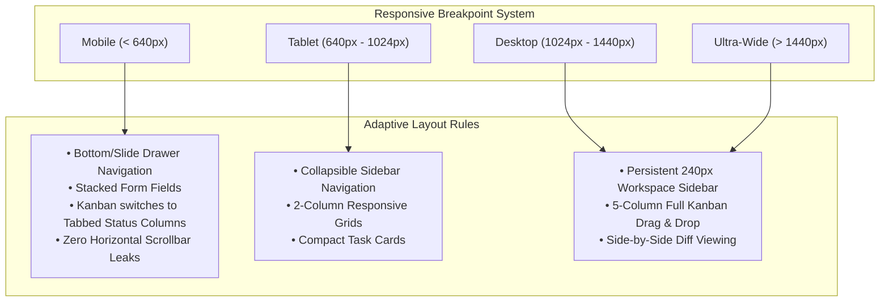

# Build Together — Design System & UI Specification

**Version:** 1.1.0  
**Status:** Approved Architectural Document  
**Design Philosophy:** Precision Technical Craft &mdash; Modern, Focused, Restrained, High-Density  

---

## 1. Aesthetic Philosophy & Visual Identity

Build Together is a tool for software creators who value **speed, clarity, and precision**. It deliberately avoids the superficial tropes of modern template dashboards in favor of an ergonomic, technical developer environment.

### Design Principles:
1. **Developer-First Ergonomics:** High information density without clutter. Clear borders, crisp typography, and intuitive keyboard navigation.
2. **Restraint over Gimmicks:** 
   - **NO** iridescent rainbow gradients or garish neon glows.
   - **NO** excessive frosted glassmorphism that obscures text readability.
   - **NO** gratuitous floating micro-animations that slow down user tasks.
3. **Intentional Hierarchy:** Contrast and typography direct the user's eye rather than decorative containers.
4. **Resilient Responsiveness:** True multi-device adaptability across phones (360px+), tablets, laptops, and wide monitors.

---

## 2. Design Tokens

### 2.1 Color Palette

```css
:root {
  /* Surface Layers (Light Mode) */
  --bg-app: #f8fafc;        /* slate-50 */
  --bg-surface-1: #ffffff;  /* white */
  --bg-surface-2: #f1f5f9;  /* slate-100 */
  --bg-surface-3: #e2e8f0;  /* slate-200 */

  /* Borders & Dividers */
  --border-subtle: #e2e8f0; /* slate-200 */
  --border-strong: #cbd5e1; /* slate-300 */
  --border-focus: #3b82f6;  /* blue-500 */

  /* Typography */
  --text-primary: #0f172a;   /* slate-900 */
  --text-secondary: #475569; /* slate-600 */
  --text-muted: #94a3b8;     /* slate-400 */
  --text-inverse: #ffffff;

  /* Technical Accents */
  --accent-primary: #0f172a;       /* slate-900 */
  --accent-primary-hover: #1e293b; /* slate-800 */
  --accent-cyan: #0284c7;          /* sky-600 */
  --accent-indigo: #4f46e5;        /* indigo-600 */

  /* Semantic Status */
  --status-success: #16a34a; /* green-600 */
  --status-warning: #d97706; /* amber-600 */
  --status-danger: #dc2626;  /* red-600 */
  --status-info: #0284c7;    /* sky-600 */
}

.dark {
  /* Surface Layers (Dark Mode Default) */
  --bg-app: #090d16;        /* Deep obsidian slate */
  --bg-surface-1: #0f172a;  /* slate-900 */
  --bg-surface-2: #1e293b;  /* slate-800 */
  --bg-surface-3: #334155;  /* slate-700 */

  /* Borders & Dividers */
  --border-subtle: #1e293b; /* slate-800 */
  --border-strong: #334155; /* slate-700 */
  --border-focus: #38bdf8;  /* sky-400 */

  /* Typography */
  --text-primary: #f8fafc;   /* slate-50 */
  --text-secondary: #94a3b8; /* slate-400 */
  --text-muted: #64748b;     /* slate-500 */
  --text-inverse: #0f172a;

  /* Technical Accents */
  --accent-primary: #38bdf8;       /* sky-400 */
  --accent-primary-hover: #7dd3fc; /* sky-300 */
  --accent-cyan: #38bdf8;
  --accent-indigo: #818cf8;

  /* Semantic Status */
  --status-success: #22c55e; /* green-500 */
  --status-warning: #f59e0b; /* amber-500 */
  --status-danger: #ef4444;  /* red-500 */
  --status-info: #38bdf8;    /* sky-400 */
}
```

### 2.2 Typography Scale
- **UI Sans:** `Geist Sans` or `Inter`, system fallback `sans-serif`.
- **Code & Numbers:** `Geist Mono` or `JetBrains Mono`, system fallback `monospace` with `font-variant-numeric: tabular-nums`.

| Token | Size | Line Height | Tracking | Recommended Use |
| :--- | :--- | :--- | :--- | :--- |
| `text-xs` | 12px (0.75rem) | 16px | +0.01em | Metadata, timestamps, status badges, code annotations. |
| `text-sm` | 14px (0.875rem)| 20px | 0 | Body text, input labels, table cell content, buttons. |
| `text-base` | 16px (1.00rem) | 24px | -0.01em | Primary headings for cards, markdown reading text. |
| `text-lg` | 18px (1.125rem)| 28px | -0.015em| Section titles, modal titles. |
| `text-xl` | 20px (1.25rem) | 28px | -0.02em | Workspace sub-module headers. |
| `text-2xl` | 24px (1.50rem) | 32px | -0.025em| Project title, main view headings. |
| `text-3xl` | 30px (1.875rem)| 36px | -0.03em | Marketing headline secondary. |
| `text-4xl` | 36px (2.25rem) | 40px | -0.035em| Marketing Hero title. |

### 2.3 Spacing & Layout Grid
- Strict **4px / 8px** incremental scale (`space-1` = 4px, `space-2` = 8px, `space-4` = 16px, `space-6` = 24px, `space-8` = 32px).
- Max reading width for prose/markdown: `max-w-3xl`.
- Full-width workspace container: `max-w-7xl` with 16px padding on mobile, 32px on desktop.

---

## 3. Core Component Library Specifications

### 3.1 Primitive Components (`components/ui/*`)

- **`Button`:** `primary`, `secondary`, `ghost`, and `danger` variants with accessible focus rings (`focus-visible:ring-2`).
- **`Badge` / `Tag`:** Compact semantic status pills (`success`, `warning`, `danger`, `info`, `neutral`).
- **`ModalDialog`:** Accessible dialog with focus trap, backdrop blur, and `Escape` key dismissal.
- **`DropdownMenu` / `Popover`:** Accessible keyboard-traversable floating menus.
- **`Tabs`:** WAI-ARIA compliant tab list with arrow key navigation.

### 3.2 Domain Components (`components/domain/*`)

#### `ProjectCard`
- Used across `/explore` and `/dashboard`.
- Displays: Project logo, title, category, development stage pill, tagline, match score pill (e.g. `92% Match`), required roles chips, and member avatars stack.

#### `MatchScoreBadge`
- Encapsulates the deterministic match score:
  - $\ge 80\%$: High match (Emerald badge with spark icon).
  - $50-79\%$: Moderate match (Sky badge).
  - $< 50\%$: Low match (Slate badge).

#### `TaskCard` (Kanban Board)
- Compact, dense card optimized for dragging.
- Displays: Task title, priority indicator icon, milestone badge, assignee avatar, and comment count pill.
- Supports keyboard reordering (Space to pick up, Arrow keys to move, Space to drop).

#### `CanvasStickyNote`
- Spatial ideation card placed on `/workspace/canvas`.
- Color options: Canary Yellow (`#fef08a`), Sky Blue (`#bae6fd`), Mint Green (`#bbf7d0`), Coral Pink (`#fbcfe8`), Lavender (`#e9d5ff`).
- Displays: Content markdown, author avatar, delete trigger, drag handle.

#### `CommunityPostCard`
- Feed card used on `/feed`.
- Header: Author avatar, name, headline, post type badge (`Project Update`, `Recruitment`, `Technical Discussion`, `Question`, etc.), timestamp.
- Body: Title, rich markdown snippet, tagged project link (if attached), topic tags.
- Action Bar: Like counter with heart icon, comment counter with speech bubble, save bookmark icon, share link trigger.

#### `CodeDiffViewer`
- Split and unified diff modes with syntax highlighting. Clickable line gutter to initiate inline code review comments.

#### `GitHubSyncIndicator`
- Visual indicator showing linked repository, default branch, latest commit hash, and webhook health status.

---

## 4. Responsive Design & Multi-Device Strategy



---

## 5. Accessibility (a11y) & Performance Compliance

1. **Contrast Compliance:** Text to background contrast ratio &ge; 4.5:1 across both light and dark themes.
2. **Keyboard Traversal:** Logical tab order; visible, un-obscured focus indicators (`focus-visible:ring-2`).
3. **Motion Sensitivity:** All transitions degrade to instantaneous cuts when `prefers-reduced-motion: reduce` is enabled.
4. **Form Usability:** Progressive feedback with `:user-valid` and `:user-invalid` pseudo-classes.
