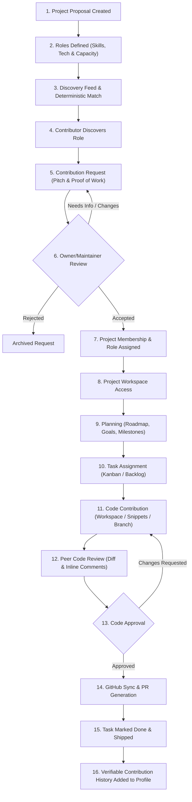

# Build Together — Product Specification

**Version:** 1.1.0  
**Status:** Approved Architectural Document  
**Date:** October 2026  
**Product:** Build Together  
**Deployment Target:** Vercel + Supabase  

---

## 1. Product Vision & Core Problem

### 1.1 The Core Problem
Many developers have ambitious software ideas but cannot implement them alone because they lack complementary technical and design skills. For example:
- A frontend engineer has a compelling web application concept but lacks expertise in distributed backend systems, DevOps infrastructure, or UI/UX design systems.
- A machine learning engineer has trained a high-performing model but requires a fullstack engineer to build a production web client and an auth/billing pipeline.
- A UI/UX designer has crafted a complete product prototype but needs skilled frontend and backend engineers to turn it into reality.

Traditional forums (Reddit, Discord servers, generic social networks) fail these creators: inquiries get buried in unstructured noise, candidate verification is impossible, there is zero accountability, and discussions rarely translate into structured development.

### 1.2 The Build Together Solution
**Build Together** enables developers to publish structured project proposals, define specific open contributor roles, and assemble committed teams. Once accepted, teams enter a dedicated, unified project workspace that guides the collaboration through every phase: from goals, roadmaps, and Kanban tasks, to internal code reviews, GitHub synchronization, and verifiable contribution histories.

```mermaid
flowchart LR
    A["1. Create Account"] --> B["2. Build Profile & Set Skills"]
    B --> C["3. Discover Projects / Roles"]
    C --> D["4. Apply or Create Project"]
    D --> E["5. Review & Form Team"]
    E --> F["6. Enter Project Workspace"]
    F --> G["7. Goals, Roadmap & Tasks"]
    G --> H["8. Collaborate & Canvas Notes"]
    H --> I["9. Internal Code Review"]
    I --> J["10. Connect GitHub & PR Export"]
    J --> K["11. Ship & Record History"]
```

### 1.3 What Build Together Is NOT
To maintain product purity and architectural focus, Build Together explicitly rejects feature bloat that dilutes the primary goal: **BUILDING**.

- **Not GitHub:** It does not host Git repositories or replace Git version control; it orchestrates the team formation, planning, internal code review, and connects approved code to user-owned GitHub repositories.
- **Not Discord / Slack:** It avoids chaotic, unstructured chat channels in favor of contextual, threaded discussions, meeting sync notes, sticky notes, and task-linked conversations.
- **Not Jira / Linear:** It does not burden teams with bureaucratic enterprise overhead; it provides streamlined, lightweight developer planning focused on shipping milestones.
- **Not a Freelancer Marketplace (Upwork/Fiverr):** No hourly billing, no freelance bidding wars, and no transactional escrow; it is focused on project co-founding, open-source building, hackathons, and collaborative product development.
- **Not a Generic Social Network:** While it contains a developer community feed, posts are strictly technical (project announcements, technical discussions, learning posts, recruitment). **No vanity algorithms and no meaningless reputation scores**. Profile value is earned purely through **verifiable contributions** to delivered projects.

---

## 2. Target User Personas

| Persona | Motivation | Key Pain Point Solved | Primary Surface Used |
| :--- | :--- | :--- | :--- |
| **Solo Founder / Tech Lead** | Has a validated product idea and architecture, but lacks domain specialists (backend, UI/UX, DevOps, mobile, AI, QA). | Current forums yield flaky, unqualified contributors with zero accountability or structure. | Project Creator Wizard, Role Definition, Contribution Review, Team Management, GitHub Linkage. |
| **Frontend / Fullstack Developer** | Wants to contribute to ambitious, real-world apps with modern stacks to build a proven track record. | Cold-contributing to massive open source repos is intimidating; finding early-stage teams with clear roles is hard. | Explore Directory, Role-Based Search, Contribution Request, Kanban Board, Code Workspace & Review. |
| **UI/UX Designer / Product Specialist** | Wants to partner with competent developers to bring design systems and interactive prototypes to life in code. | Designers struggle to find developers who appreciate design fidelity and maintain collaborative project roadmaps. | Project Discovery, Workspace Notes/Canvas, Design Asset Sharing, Goal Tracking. |
| **Student / Junior Engineer** | Needs verifiable proof of real teamwork and code contributions on production apps to secure employment. | Catch-22: needs experience to get hired, but cannot gain teamwork experience alone. | Verifiable Contribution History, Code Review Participation, Task Execution. |

---

## 3. End-to-End User Journey

---

## 4. Detailed Functional Domains & Specifications

### 4.1 Authentication & Onboarding
- **Methods:**
  - Supabase Auth with GitHub OAuth (primary for developers).
  - Magic Link / Email Password fallback for non-code collaborators.
- **Onboarding Pipeline:**
  - Username selection (slug-safe, uniqueness enforced).
  - Developer identity configuration: headline, timezone, weekly availability commitment (hours/week), primary skills, and framework tags.
  - Optional GitHub account profile synchronization (avatar, bio, and public repos).
- **Session Handling:** Next.js Server-Side Cookie sessions via `@supabase/ssr` with auto-refreshing JWTs.

### 4.2 Developer Profiles & Verified Contribution Portfolio
- **Core Profile Data:**
  - Profile photo / avatar, banner image, full name, username, headline, bio.
  - Location, primary timezone, weekly availability commitment.
  - Skills taxonomy (e.g., React, TypeScript, PostgreSQL, UI Design) tagged with self-assessment proficiency.
  - Technologies taxonomy (e.g., Next.js, Supabase, Tailwind, Docker, GraphQL).
  - Professional experience entries (`profile_experiences`): title, company/project, start/end dates, current status, description.
  - External links: GitHub, portfolio website, LinkedIn, X/Twitter.
- **Social & Community Activity:**
  - Authored community posts, comments, likes, saved posts, and direct developer connections.
- **Verified Contributions:**
  - Distinct from unverified claims: only projects where the user was an accepted member and completed tasks/code reviews appear with the "Verified Contributor" badge.
  - Contribution metrics: Completed Tasks, Approved Code Reviews, Project Milestones shipped.
  - **Rule:** Strict prohibition of arbitrary numeric reputation scores (e.g. "Karma 420"). Everything is backed by concrete project activity logs.

### 4.3 Deterministic Project & Contributor Matching Engine
Rather than fabricating a simulated AI recommendation engine, Build Together implements a **deterministic matching algorithm** based on available structured data:

$$\text{Match Score} = S_{\text{skills}} + S_{\text{tech}} + S_{\text{avail}} + S_{\text{tz}}$$

1. **Skill Alignment ($S_{\text{skills}}$, max 40 pts):**
   Overlap between contributor's tagged skills and the project's required open role skills:
   $$S_{\text{skills}} = \frac{|\text{User Skills} \cap \text{Role Skills}|}{|\text{Role Skills}|} \times 40$$
2. **Technology Stack Overlap ($S_{\text{tech}}$, max 30 pts):**
   Overlap between contributor's declared technologies and project technologies:
   $$S_{\text{tech}} = \frac{|\text{User Tech} \cap \text{Project Tech}|}{|\text{Project Tech}|} \times 30$$
3. **Availability Compatibility ($S_{\text{avail}}$, max 20 pts):**
   Evaluates if the contributor's weekly hours satisfy the role's required commitment:
   - Contributor hours $\ge$ Role required hours: **20 pts**
   - Contributor hours between $0.5 \times$ and $1.0 \times$: **10 pts**
   - Less than $0.5 \times$: **0 pts**
4. **Timezone Proximity ($S_{\text{tz}}$, max 10 pts):**
   Calculates UTC offset delta between project owner and contributor:
   - $\Delta \le 3$ hours: **10 pts**
   - $\Delta \le 6$ hours: **5 pts**
   - $\Delta > 6$ hours: **2 pts**

*Total Score (0–100%)* powers personalized project recommendations on `/explore` and candidate ranking for project maintainers.

### 4.4 Project Discovery & Exploration Engine
- **Faceted Search & Filters:**
  - Full-text search: Project title, tagline, description, problem statement.
  - Technology stack tags: Next.js, Supabase, Tailwind, Python, Rust, etc.
  - Development Stage: `Idea`, `Planning`, `In Development`, `Testing`, `Shipped`.
  - Open Roles filter: e.g. `Backend Engineer`, `UI/UX Designer`, `DevOps Engineer`, `Mobile Developer`, `AI Engineer`, `QA Engineer`.
  - Commitment levels: `< 5 hrs/week`, `5-15 hrs/week`, `15+ hrs/week`.
  - Visibility: Public (discoverable) vs Private (unlisted/invite-only).
- **Role Directory (`/explore/roles`):**
  - Cross-project board for open positions, allowing contributors to apply directly to specific roles.

### 4.5 Developer Community Feed
A developer-focused public discussion stream designed for technical discourse rather than vanity content:
- **Post Types:**
  - `project_announcement`: Launching a new project proposal or major milestone.
  - `recruitment`: Project owners actively searching for specific skills.
  - `technical_discussion`: Architecture trade-offs, engineering decisions, and RFCs.
  - `project_update`: Progress logs, changelogs, and weekly sprint demos.
  - `question`: Technical assistance, stack advice, or feedback requests.
  - `achievement`: Celebrating shipped projects, merged reviews, or public launches.
  - `learning`: Insights, post-mortems, and technical tutorials.
- **Interactions:**
  - Like, comment, nested replies, bookmark/save, user mention (`@username`), and direct connection requests.

### 4.6 Developer Connections Network
- Two-way peer connection system (`user_connections`):
  - Developers can send connection requests to collaborate on future projects.
  - Connection status: `pending`, `accepted`, `declined`, `blocked`.
  - Enables easy team invitations when creating new projects.

### 4.7 Contribution Request State Machine
Applications follow a strict finite-state machine (FSM):

| State | Initiator | Transitions To | Description |
| :--- | :--- | :--- | :--- |
| `pending` | Contributor | `under_review`, `withdrawn` | Contributor submits pitch, portfolio links, and requested role. |
| `under_review` | Maintainer | `accepted`, `rejected`, `info_requested` | Maintainer opens and inspects applicant profile and pitch. |
| `info_requested` | Maintainer | `pending`, `withdrawn` | Maintainer requests clarification; applicant replies. |
| `accepted` | Maintainer | *Final* | User is automatically added to `project_members` with designated role. |
| `rejected` | Maintainer | *Final* | Request closed with optional polite feedback note. |
| `withdrawn` | Contributor | *Final* | Contributor cancels application before decision. |

### 4.8 Project Workspace
The Workspace is the unified command center for accepted project members. It contains 16 dedicated sub-modules:
1. **Overview:** Project status banner, milestone progress bar, fast action bar, active member roster, and recent audit activity.
2. **Goals:** High-level strategic objectives (e.g. "Launch v1 on Product Hunt", "Implement Stripe Payments").
3. **Roadmap:** Chronological milestone timeline mapping goals to calendar targets.
4. **Milestones:** Discrete deliverables grouping tasks together.
5. **Tasks & Kanban Board:** Linear/Kanban task board with drag-and-drop status lanes (`Backlog`, `Todo`, `In Progress`, `Review`, `Done`), filtering by milestone, assignee, priority, and labels.
6. **Discussions:** Asynchronous, categorized, markdown-enabled discussion threads for architectural decisions and brainstorms.
7. **Meetings & Meeting Notes:** Scheduled sync times, agendas, meeting minutes, and action item logs.
8. **Notes:** Shared documentation and living specs with rich markdown editing.
9. **Project Canvas & Sticky Notes:** Freeform visual ideation surface for sticky notes (ideas, architecture notes, tech stack decisions, risks) with color coding and spatial positioning.
10. **Files:** Project assets, design exports, and architecture diagrams stored securely in Supabase Storage.
11. **Code Workspace:** Lightweight in-browser file browser, code viewer with syntax highlighting, and snippet draft editor.
12. **Code Review:** Peer review module supporting multi-file diff viewing, line-by-line comment threads, and explicit approval states (`draft`, `review`, `changes_requested`, `approved`, `merged`).
13. **Activity Feed:** Immutable audit trail of all workspace actions (tasks created, status changed, members joined).
14. **Team:** Member roster, role management, permission updates, and pending contribution applications.
15. **Settings:** Project branding, visibility toggles, category updates, and deletion/archival controls.
16. **GitHub Integration:** Repository linkage, default branch configuration, webhook status, and PR export history.

### 4.9 Task & Issue Tracking
- **Attributes:** Title, rich markdown description, checklists, status (`backlog`, `todo`, `in_progress`, `review`, `done`), priority (`low`, `medium`, `high`, `urgent`), assignee, creator, milestone link, estimated hours, due date, tags, and threaded discussion comments.

### 4.10 Code Review Engine & GitHub Integration
- **Internal Review Workflow:**
  1. Author drafts code proposal / snippet bundle in internal code workspace.
  2. Submits proposal for review, designating project reviewers.
  3. Reviewers inspect syntax-highlighted diffs and leave inline line-specific comments.
  4. Reviewers issue a verdict: `Approve` or `Request Changes`.
  5. Once approved by project maintainers, the change is marked ready for GitHub PR export.
- **GitHub Integration for User Repositories:**
  - Build Together connects to the user's GitHub repository via OAuth/App permissions.
  - **No Unsafe Automatic Pushes:** GitHub operations must be explicitly triggered by authorized maintainers.
  - One-click "Export to GitHub PR": creates a remote branch, pushes commits, and opens a GitHub Pull Request with backlinks to the Build Together review thread.
  - Webhooks track when the PR is merged on GitHub, automatically transitioning the Build Together task to `done` and the review to `merged`.

---

## 5. Non-Functional Requirements (NFRs)

### 5.1 Performance & Core Web Vitals
- **LCP (Largest Contentful Paint):** $\le$ 1.2s on desktop, $\le$ 2.0s on mobile.
- **INP (Interaction to Next Paint):** $\le$ 100ms.
- **CLS (Cumulative Layout Shift):** $\le$ 0.05.
- React Server Components (RSC) utilized by default to minimize client bundle weight.

### 5.2 Security & Data Protection
- 100% of tables protected by PostgreSQL Row Level Security (RLS).
- Strict separation of public environment variables (`NEXT_PUBLIC_*`) and server-only secrets.
- Encrypted storage of user GitHub OAuth tokens using authenticated AES-256-GCM.
- Zero client-side exposure of Supabase `service_role` keys or GitHub secrets.
- Robust input sanitization for user-submitted markdown and HTML previews.

### 5.3 Accessibility & Responsive Behavior
- WCAG 2.1 Level AA compliance across all primary flows.
- Full keyboard navigation for modal dialogs, dropdowns, sticky notes canvas, and Kanban boards.
- Intentional responsive layouts for mobile (360px+), tablets, laptops, and ultra-wide screens.
