# Build Together — Route Map & Navigation Architecture

**Version:** 1.1.0  
**Status:** Approved Architectural Document  
**Framework:** Next.js 15+ App Router (`src/app`)  

---

## 1. Route Hierarchy & Layout Matrix

```mermaid
flowchart TD
    Root["Root Layout (app/layout.tsx)\n• ThemeProvider\n• ToastProvider\n• SessionProvider"]

    Root --> M_Layout["Marketing Layout (app/(marketing)/layout.tsx)\n• Public Header with CTA\n• Public Footer"]
    Root --> Auth_Layout["Auth Layout (app/(auth)/layout.tsx)\n• Centered Form Card"]
    Root --> App_Layout["App Layout (app/(app)/layout.tsx)\n• Global Navigation Bar\n• Notification Bell\n• User Menu\n• Command Palette"]

    M_Layout --> Page_Home["/ (Landing Page)"]
    M_Layout --> Page_Search["/search (Global Discovery & Search)"]
    M_Layout --> Page_Explore["/explore (Projects Directory)"]
    M_Layout --> Page_Roles["/explore/roles (Open Roles)"]
    M_Layout --> Page_Devs["/explore/developers (Developer Directory)"]
    M_Layout --> Page_Feed["/feed (Community Feed)"]
    M_Layout --> Page_PostView["/feed/[postId] (Post Thread)"]
    M_Layout --> Page_ProjView["/projects/[slug] (Public Project Showcase)"]
    M_Layout --> Page_DevView["/developers/[username] (Public Portfolio)"]

    Auth_Layout --> Page_Login["/login"]
    Auth_Layout --> Page_Register["/register"]
    Auth_Layout --> Page_AuthCb["/auth/callback"]

    App_Layout --> Page_Dashboard["/dashboard (User Command Center)"]
    App_Layout --> Page_Network["/network (Peer Connections)"]
    App_Layout --> Page_ProjNew["/projects/new (Project Wizard)"]
    App_Layout --> Page_Settings["/settings/* (Profile, Account, Connections)"]

    App_Layout --> WS_Layout["Workspace Layout (app/(app)/projects/[slug]/workspace/layout.tsx)\n• Project Workspace Sidebar (16 sub-modules)\n• Quick Action Bar\n• Team Presence Indicator"]

    WS_Layout --> WS_Overview["/workspace (Overview)"]
    WS_Layout --> WS_Goals["/workspace/goals"]
    WS_Layout --> WS_Roadmap["/workspace/roadmap"]
    WS_Layout --> WS_Milestones["/workspace/milestones"]
    WS_Layout --> WS_Tasks["/workspace/tasks"]
    WS_Layout --> WS_Discussions["/workspace/discussions"]
    WS_Layout --> WS_Meetings["/workspace/meetings"]
    WS_Layout --> WS_Notes["/workspace/notes"]
    WS_Layout --> WS_Canvas["/workspace/canvas (Sticky Notes & Ideation)"]
    WS_Layout --> WS_Files["/workspace/files"]
    WS_Layout --> WS_Code["/workspace/code"]
    WS_Layout --> WS_Reviews["/workspace/reviews"]
    WS_Layout --> WS_Activity["/workspace/activity"]
    WS_Layout --> WS_Team["/workspace/team"]
    WS_Layout --> WS_GitHub["/workspace/github"]
    WS_Layout --> WS_Settings["/workspace/settings"]
```

---

## 2. Comprehensive Route Registry

| URL Path | File Path | Rendering Type | Access Level | Description & Key Features |
| :--- | :--- | :--- | :--- | :--- |
| **`/`** | `app/(marketing)/page.tsx` | Static / ISR | Public | High-impact product landing page; explains the build journey, featured projects, and live open roles. |
| **`/search`** | `app/(marketing)/search/page.tsx` | Dynamic RSC + Filter Tabs | Public (Privacy-Enforced) | Global multi-entity discovery engine across projects, developers, community posts, and authorized workspace tasks with faceted filtering tabs and URL state sync. |
| **`/explore`** | `app/(explore)/explore/page.tsx` | Dynamic RSC + Suspense | Public | Searchable project discovery directory with filters for stage, tech stack, and deterministic match scores. |
| **`/explore/roles`** | `app/(explore)/explore/roles/page.tsx` | Dynamic RSC + Suspense | Public | Cross-project open roles board; apply directly to matching skill positions. |
| **`/explore/developers`** | `app/(explore)/explore/developers/page.tsx` | Dynamic RSC + Suspense | Public | Contributor directory highlighting verified past contributions, experience, and skill tags. |
| **`/feed`** | `app/(marketing)/feed/page.tsx` | Dynamic RSC + Suspense | Public | Developer community feed (announcements, recruitment, tech discussions, updates, questions). |
| **`/feed/[postId]`** | `app/(marketing)/feed/[postId]/page.tsx` | Dynamic RSC + Comment Leaf | Public | Threaded discussion view for a community post with likes, nested comments, and saves. |
| **`/projects/[slug]`** | `app/(marketing)/projects/[slug]/page.tsx` | Dynamic RSC | Public | Public project showcase detailing problem statement, solution, active team, and open roles with an "Apply to Contribute" modal. |
| **`/developers/[username]`** | `app/(marketing)/developers/[username]/page.tsx` | Dynamic RSC | Public | Public developer portfolio displaying verified shipped projects, GitHub stats, experience, and skills. |
| **`/login`** | `app/(auth)/login/page.tsx` | Client Leaf Component | Public | GitHub OAuth authentication and passwordless magic link login. |
| **`/register`** | `app/(auth)/register/page.tsx` | Client Leaf Component | Public | Account creation flow. |
| **`/auth/callback`** | `app/(auth)/callback/route.ts` | Route Handler | Public | Supabase Auth code-for-token exchange and redirection. |
| **`/dashboard`** | `app/(app)/dashboard/page.tsx` | Dynamic RSC | Authenticated | User's personal command center: active projects, pending contribution requests, and assigned tasks. |
| **`/network`** | `app/(app)/network/page.tsx` | Dynamic RSC + Actions | Authenticated | Manage peer connections, incoming connection invites, and discover mutual collaborators. |
| **`/projects/new`** | `app/(app)/projects/new/page.tsx` | Interactive Client Wizard | Authenticated | Multi-step project creation wizard: basic info, problem/solution, and contributor role definitions. |
| **`/settings/profile`** | `app/(app)/settings/profile/page.tsx` | Dynamic RSC + Form Leaf | Authenticated | Manage avatar, headline, bio, weekly availability, experience history, and skills. |
| **`/settings/account`** | `app/(app)/settings/account/page.tsx` | Dynamic RSC + Form Leaf | Authenticated | Email, security credentials, and session management. |
| **`/settings/connections`** | `app/(app)/settings/connections/page.tsx` | Dynamic RSC + Actions | Authenticated | Manage linked personal GitHub account and OAuth permissions. |
| **`/projects/[slug]/workspace`** | `app/(app)/projects/[slug]/workspace/page.tsx` | Dynamic RSC | Project Member | Workspace dashboard: milestone progress, fast action bar, active member roster, and recent audit activity. |
| **`.../workspace/goals`** | `app/(app)/.../goals/page.tsx` | Dynamic RSC | Project Member | Strategic goals list and alignment tracking. |
| **`.../workspace/roadmap`** | `app/(app)/.../roadmap/page.tsx` | Dynamic RSC | Project Member | Chronological milestone roadmap view. |
| **`.../workspace/milestones`** | `app/(app)/.../milestones/page.tsx` | Dynamic RSC | Project Member | Milestone tracking and grouped task views. |
| **`.../workspace/tasks`** | `app/(app)/.../tasks/page.tsx` | RSC + Client Kanban Board | Project Member | Drag-and-drop Kanban task board with status filtering (`backlog`, `todo`, `in_progress`, `review`, `done`). |
| **`.../workspace/tasks/[taskId]`** | `app/(app)/.../tasks/[taskId]/page.tsx` | Dynamic RSC + Modal/Sheet | Project Member | Task detail view: markdown description, checklists, attachments, and threaded comments. |
| **`.../workspace/discussions`** | `app/(app)/.../discussions/page.tsx` | Dynamic RSC | Project Member | Categorized discussion board for architecture decisions and RFCs. |
| **`.../workspace/discussions/[discussionId]`** | `app/(app)/.../discussions/[discussionId]/page.tsx` | Dynamic RSC + Comment Leaf | Project Member | Threaded discussion view with rich markdown comments. |
| **`.../workspace/meetings`** | `app/(app)/.../meetings/page.tsx` | Dynamic RSC | Project Member | Meeting agendas, scheduled sync times, notes, and action item logs. |
| **`.../workspace/notes`** | `app/(app)/.../notes/page.tsx` | RSC + Markdown Editor Leaf | Project Member | Collaborative project documentation, living specs, and tech docs. |
| **`.../workspace/canvas`** | `app/(app)/.../canvas/page.tsx` | Client Interactive Canvas | Project Member | Freeform visual ideation board with draggable, color-coded sticky notes and decision cards. |
| **`.../workspace/files`** | `app/(app)/.../files/page.tsx` | Dynamic RSC + Upload Leaf | Project Member | Asset and file manager backed by Supabase Storage bucket `workspace-files`. |
| **`.../workspace/code`** | `app/(app)/.../code/page.tsx` | RSC + Syntax Viewer Leaf | Project Member | Lightweight in-platform code browser and snippet drafting environment. |
| **`.../workspace/reviews`** | `app/(app)/.../reviews/page.tsx` | Dynamic RSC | Project Member | Internal code review queue filtered by status (`draft`, `review`, `changes_requested`, `approved`, `merged`). |
| **`.../workspace/reviews/[reviewId]`** | `app/(app)/.../reviews/[reviewId]/page.tsx` | RSC + Diff Viewer Leaf | Project Member | Multi-file diff viewer with inline line-by-line comment threads and approval decisions. |
| **`.../workspace/activity`** | `app/(app)/.../activity/page.tsx` | Dynamic RSC | Project Member | Immutable audit trail of all project events and member changes. |
| **`.../workspace/team`** | `app/(app)/.../team/page.tsx` | Dynamic RSC + Review Modals | Project Member | Team roster management, role assignments, and applicant review pipeline. |
| **`.../workspace/github`** | `app/(app)/.../github/page.tsx` | Dynamic RSC + Config Leaf | Project Admin | User project repository connection, webhook status, and PR export controls. |
| **`.../workspace/settings`** | `app/(app)/.../settings/page.tsx` | Dynamic RSC + Form Leaf | Project Admin | Project configuration, visibility toggles, and deletion/archive controls. |
| **`/api/health`** | `app/api/health/route.ts` | Route Handler | Public | System uptime and database connection verification. |
| **`/api/github/callback`** | `app/api/github/callback/route.ts` | Route Handler | Authenticated | GitHub OAuth authorization callback for connecting user repositories. |
| **`/api/github/webhooks`** | `app/api/github/webhooks/route.ts` | Route Handler | External (GitHub) | Verified webhook receiver for user repo pull requests and commits. |
| **`/api/storage/presigned-upload`** | `app/api/storage/presigned-upload/route.ts` | Route Handler | Authenticated | Generates secure presigned upload tokens for direct Supabase Storage writes. |

---

## 3. Middleware & Route Protection Strategy

Next.js Edge Middleware (`src/middleware.ts`) refreshes the Supabase Auth session cookie and guards protected paths:
- Unauthenticated requests to `/dashboard/*`, `/network/*`, `/settings/*`, `/projects/new`, or `/projects/[slug]/workspace/*` are redirected to `/login?redirect=<path>`.
- Authenticated requests to `/login` or `/register` are redirected to `/dashboard`.
- Database Row Level Security (RLS) acts as the impenetrable defense verifying project membership on workspace routes.
