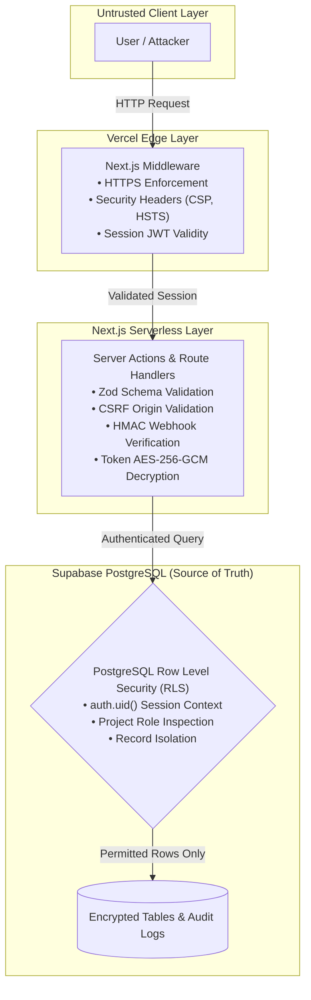

# Build Together — Security Model & Governance

**Version:** 1.1.0  
**Status:** Approved Architectural Document  
**Security Paradigm:** Defense in Depth (Database RLS + Server Enforcement + Edge Guarding)  

---

## 1. Security Architecture & Threat Model

Build Together operates on a zero-trust client paradigm: **no client-side security checks are trusted**. All authorization is anchored in Supabase PostgreSQL Row Level Security (RLS) policies and verified in Next.js Server Actions.



---

## 2. Row Level Security (RLS) Policy Specifications

Every table in the `public` schema has Row Level Security enabled (`ALTER TABLE ... ENABLE ROW LEVEL SECURITY;`). Default behavior: **DENY ALL**.

### 2.1 Helper Functions
```sql
CREATE OR REPLACE FUNCTION public.is_project_member(_project_id UUID, _user_id UUID)
RETURNS BOOLEAN AS $$
  SELECT EXISTS (
    SELECT 1 FROM public.project_members
    WHERE project_id = _project_id AND user_id = _user_id
  );
$$ LANGUAGE sql STABLE SECURITY DEFINER;

CREATE OR REPLACE FUNCTION public.is_project_admin(_project_id UUID, _user_id UUID)
RETURNS BOOLEAN AS $$
  SELECT EXISTS (
    SELECT 1 FROM public.project_members
    WHERE project_id = _project_id
      AND user_id = _user_id
      AND role IN ('owner', 'maintainer')
  );
$$ LANGUAGE sql STABLE SECURITY DEFINER;
```

### 2.2 Table-by-Table Policy Specifications

#### 1. `profiles` & `profile_experiences`
- **SELECT:** Public (`true`). Anyone can view developer portfolios.
- **INSERT / UPDATE / DELETE:** Authenticated user operating on their own profile (`auth.uid() = id` or `auth.uid() = profile_id`).

#### 2. `user_connections`
- **SELECT:** Participants only (`auth.uid() IN (requester_id, recipient_id)`).
- **INSERT:** Authenticated user initiating request (`auth.uid() = requester_id`).
- **UPDATE:** Recipient accepting/declining (`auth.uid() = recipient_id`).
- **DELETE:** Either party disconnecting (`auth.uid() IN (requester_id, recipient_id)`).

#### 3. `community_posts` & `post_comments`
- **SELECT:** Public (`true`).
- **INSERT:** Authenticated user (`auth.uid() = author_id`).
- **UPDATE / DELETE:** Author only (`auth.uid() = author_id`).

#### 4. `post_likes` & `post_saves`
- **SELECT:** Public for likes; user-only for saves (`auth.uid() = user_id`).
- **INSERT / DELETE:** Self only (`auth.uid() = user_id`).

#### 5. `projects`
- **SELECT:** Public if `visibility = 'public'`, or member if private (`is_project_member(id, auth.uid())`).
- **INSERT:** Authenticated users (`auth.role() = 'authenticated'`).
- **UPDATE:** Project owner or maintainers (`is_project_admin(id, auth.uid())`).
- **DELETE:** Project owner only (`owner_id = auth.uid()`).

#### 6. `project_roles`
- **SELECT:** Public if parent project is public, or if member.
- **INSERT / UPDATE / DELETE:** Project admins (`is_project_admin(project_id, auth.uid())`).

#### 7. `project_members`
- **SELECT:** Public if parent project is public, or if caller is a member.
- **INSERT:** Trigger on application acceptance or project admins.
- **UPDATE / DELETE:** Project admins, or user removing themselves.

#### 8. `contribution_requests`
- **SELECT:** Applicant (`applicant_id = auth.uid()`) or project admins (`is_project_admin(project_id, auth.uid())`).
- **INSERT:** Authenticated user applying for own identity (`applicant_id = auth.uid()`).
- **UPDATE:** Applicant can withdraw; admins can review.
- **DELETE:** Forbidden.

#### 9. `goals`, `milestones`, `tasks`, `task_comments`, `discussions`, `discussion_comments`, `project_notes`, `project_files`, `project_canvas_items`
- **SELECT:** Project members only (`is_project_member(project_id, auth.uid())`).
- **INSERT / UPDATE:** Project members only.
- **DELETE:** Content author or project admins.

#### 10. `code_snippets`, `code_reviews`, `code_review_files`, `code_review_comments`
- **SELECT:** Project members only (`is_project_member(project_id, auth.uid())`).
- **INSERT / UPDATE:** Project members only.
- **DELETE:** Review author or project admins.

#### 11. `user_github_accounts`
- **SELECT / ALL:** User only (`auth.uid() = user_id`). Access token is AES-256-GCM encrypted.

#### 12. `project_github_repos`
- **SELECT:** Project members (`is_project_member(project_id, auth.uid())`). Note: Server query functions strip `encrypted_access_token` so client components never receive tokens.
- **INSERT / UPDATE / DELETE:** Project admins only (`is_project_admin(project_id, auth.uid())`).

#### 13. `github_webhook_events`
- **SELECT:** Project admins only (`is_project_admin(project_id, auth.uid())`).
- **INSERT:** Server-only (service role client in webhook route handler).

#### 14. `notifications`
- **SELECT:** Recipient only (`recipient_id = auth.uid()`).
- **INSERT:** Authenticated actor only (`auth.uid() = actor_id`).
- **UPDATE / DELETE:** Recipient only (`recipient_id = auth.uid()`).

#### 15. `user_connections`
- **SELECT:** Participants only (`auth.uid() IN (requester_id, recipient_id)`).
- **INSERT:** Authenticated requester only (`auth.uid() = requester_id`), protected by bidirectional unique index on `(LEAST(requester_id, recipient_id), GREATEST(requester_id, recipient_id))` and check constraint against self-connections.
- **UPDATE:** Recipient only for accepting/declining requests.
- **DELETE:** Either participant.

#### 16. `community_posts` & `post_comments`
- **SELECT:** Viewable by everyone.
- **INSERT:** Authenticated author only (`auth.uid() = author_id`). Server-side validation additionally verifies that the author is an owner or active member of the project before permitting `project_id` association.
- **UPDATE / DELETE:** Author only (`auth.uid() = author_id`).

#### 17. `post_likes` & `post_saves`
- **SELECT:** Likes viewable by everyone; saves viewable only by owner (`auth.uid() = user_id`).
- **INSERT / DELETE:** Owner only (`auth.uid() = user_id`). Primary key on `(post_id, user_id)` prevents duplicate likes/saves.

#### 18. `activity_logs`
- **SELECT:** Project members only (`is_project_member(project_id, auth.uid())`).
- **INSERT / UPDATE / DELETE:** Append-only via server actions. Tokens and credentials are never stored in activity logs.

---

## 3. Environment Variable Security & Secret Segregation

```ini
# CLIENT-SAFE (NEXT_PUBLIC_ prefix)
NEXT_PUBLIC_APP_URL="https://buildtogether.dev"
NEXT_PUBLIC_SUPABASE_URL="https://xyz.supabase.co"
NEXT_PUBLIC_SUPABASE_ANON_KEY="eyJhbGciOiJIUzI1NiIsInR5cCI6IkpXVCJ9..."

# SERVER-ONLY (Node.js runtime only — never exposed to client)
SUPABASE_SERVICE_ROLE_KEY="eyJhbGciOiJIUzI1NiIsInR5cCI6IkpXVCJ9..."
ENCRYPTION_KEY="0123456789abcdef0123456789abcdef0123456789abcdef0123456789abcdef"
GITHUB_CLIENT_ID="gh_client_123456"
GITHUB_CLIENT_SECRET="gh_secret_abcdef123456"
GITHUB_WEBHOOK_SECRET="whsec_0987654321fedcba"
```

---

## 4. User GitHub Token Encryption at Rest

User repositories are third-party assets requiring high-grade confidentiality. We use authenticated **AES-256-GCM** with a unique Initialization Vector (IV) per encryption operation:

```typescript
import { createCipheriv, createDecipheriv, randomBytes } from 'crypto';

const ALGORITHM = 'aes-256-gcm';
const KEY = Buffer.from(process.env.ENCRYPTION_KEY!, 'hex'); // 32 bytes

export function encryptSecret(plainText: string): string {
  const iv = randomBytes(12);
  const cipher = createCipheriv(ALGORITHM, KEY, iv);
  let encrypted = cipher.update(plainText, 'utf8', 'hex');
  encrypted += cipher.final('hex');
  const authTag = cipher.getAuthTag().toString('hex');
  return `${iv.toString('hex')}:${authTag}:${encrypted}`;
}

export function decryptSecret(cipherPayload: string): string {
  const [ivHex, authTagHex, encrypted] = cipherPayload.split(':');
  if (!ivHex || !authTagHex || !encrypted) throw new Error('Invalid cipher payload');
  const iv = Buffer.from(ivHex, 'hex');
  const authTag = Buffer.from(authTagHex, 'hex');
  const decipher = createDecipheriv(ALGORITHM, KEY, iv);
  decipher.setAuthTag(authTag);
  let decrypted = decipher.update(encrypted, 'hex', 'utf8');
  decrypted += decipher.final('utf8');
  return decrypted;
}
```

---

## 5. Webhook Security & Tamper Resistance

Incoming GitHub webhooks (`/api/github/webhooks`) are verified using constant-time cryptographic signatures:

```typescript
import { createHmac, timingSafeEqual } from 'crypto';

export function verifyGitHubWebhook(rawBody: string, signatureHeader: string | null): boolean {
  if (!signatureHeader || !signatureHeader.startsWith('sha256=')) return false;
  const expectedSignature = 'sha256=' + createHmac('sha256', process.env.GITHUB_WEBHOOK_SECRET!)
    .update(rawBody)
    .digest('hex');
  const sourceBuffer = Buffer.from(signatureHeader);
  const targetBuffer = Buffer.from(expectedSignature);
  if (sourceBuffer.length !== targetBuffer.length) return false;
  return timingSafeEqual(sourceBuffer, targetBuffer);
}
```

---

## 6. HTTP Security Headers & Markdown Sanitization

Configured in `next.config.ts` (CSP, HSTS, X-Frame-Options: DENY, X-Content-Type-Options: nosniff). All user markdown is sanitized via `rehype-sanitize` to disallow raw executable HTML tags and script injection.

---

## 7. Hard Security Invariant: No Unsafe Automatic Pushes

Build Together enforces strict boundaries on external repository mutations:
- **No Automatic Pushes:** In-platform code review approvals alone NEVER trigger pushes to external GitHub repositories.
- **Explicit User Authorization:** Pushing code changes to GitHub requires an explicit, separate user action via the `ExportPrDialog` with mandatory checkbox confirmation.
- **No Direct Commits to Default Branch:** All exports create a separate feature branch (`bt/<branch>-<id>`) and open a Pull Request. Force pushes and direct commits to `main` are strictly forbidden.
- **Auditability:** Every PR export records an immutable activity log entry attributing the actor, branch, and PR number. Token credentials never appear in activity logs.

---

## 8. Global Search Privacy & Visibility Boundaries

Search operations strictly enforce data visibility and tenant boundaries:
1. **Public vs. Private Projects:**
   - Unauthenticated visitors can only search projects with `visibility = 'public'`.
   - Private projects are strictly restricted to the project owner and accepted project members (`project_members`).
2. **Community Posts & Project Containment:**
   - Posts linked to private projects are only queryable if the requesting user is a verified member of that private project.
3. **Workspace Tasks Isolation:**
   - Workspace tasks are never exposed publicly. Unauthenticated search queries return an empty task list (`tasks: []`).
   - Authenticated users can only search tasks belonging to projects where they are an active member or owner (`userMemberProjectIds`).
4. **Input Sanitization & Query Protection:**
   - All search queries are strictly validated via Zod (`searchQuerySchema`), trimmed, and length-bounded (1 to 100 characters).
   - Database queries use parameterized queries and escaped pattern matching, preventing SQL injection and memory exhaustion.

